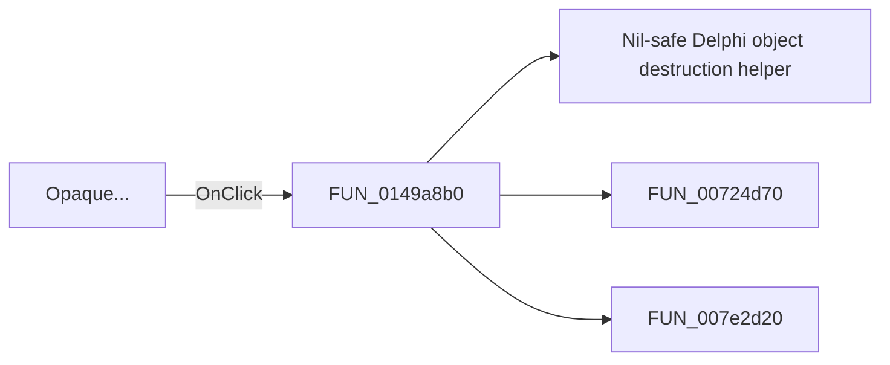

# Opaque...

> Analysis status: Pending individual source review.

## Control

| Property | Recovered value |
| --- | --- |
| Form | frmDesignTool |
| Component path | frmDesignTool.pmBackground.Background1.OpaqueMnu |
| Control class | TMenuItem |
| Caption | Opaque... |
| Hint | Not present in the recovered resource. |
| Text | Not present in the recovered resource. |
| Handler name | OpaqueMnuClick |
| Handler address | 0149a8b0 |
| Graph node | `resource:dfm:frmDesignTool/frmDesignTool.pmBackground.Background1.OpaqueMnu` |
| Handler node | `function:0149a8b0` |
| Graph layer | UI |

## What happens when clicked

Pending individual analysis. An agent must read the recovered handler source and its relevant callees before it replaces this text.

## Click flow

## Handler evidence

- Source: [DecompiledSources/Tina16/functions/000000000149A8B0__FUN_0149a8b0.c](../../../DecompiledSources/Tina16/functions/000000000149A8B0__FUN_0149a8b0.c)
- Recovered role: Not present in the recovered resource.
- Current graph summary: Handles 1 Delphi UI event: frmDesignTool.pmBackground.Background1.OpaqueMnu.OnClick.
- Current graph behavior: Not present in the recovered resource.
- Current graph evidence: Not present in the recovered resource.
- Complexity: complex
- Distinct outgoing calls: 3

## Direct calls

- `function:00410f20` — Nil-safe Delphi object destruction helper
- `function:00724d70` — FUN_00724d70
- `function:007e2d20` — FUN_007e2d20

## Resource evidence

- Kind: Not present in the recovered resource.
- Modal result: Not present in the recovered resource.
- Checked state: Not present in the recovered resource.
- List items: Not present in the recovered resource.
- Image reference: Not present in the recovered resource.
- Extracted glyph: None.

## Nearby label candidates

Nearby labels are layout candidates only. They are not proof of behavior.

- No same-parent label candidate is available.

## Analysis limits

- Do not infer behavior from the control class, caption, hint, glyph, or nearby label alone.
- Do not replace the pending status until the handler source and relevant call path provide enough evidence.
