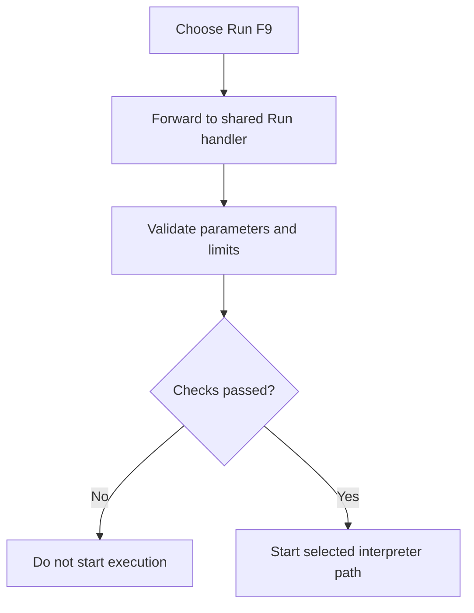

# Run F9

> Analysis status: Complete. This menu command forwards to the same execution handler as both Run buttons.

## Control

| Property | Recovered value |
| --- | --- |
| Form | frmDesignTool |
| Component path | frmDesignTool.mnMainMenu.mnRun.RunF91 |
| Control class | TMenuItem |
| Caption | Run F9 |
| Hint | Not present in the recovered resource. |
| Text | Not present in the recovered resource. |
| Handler name | RunF91Click |
| Handler address | 01498bc0 |
| Graph node | `resource:dfm:frmDesignTool/frmDesignTool.mnMainMenu.mnRun.RunF91` |
| Handler node | `function:01498bc0` |
| Graph layer | UI |

## What happens when clicked

The handler calls `FUN_01496950` directly. The shared handler applies the license warning where applicable, validates parameter names, expressions, and limits, selects the current interface path, and starts execution only when all required checks pass. The caption includes the recovered F9 shortcut text, but keyboard routing is outside this OnClick handler.

## Click flow

## Handler evidence

- Source: [DecompiledSources/Tina16/functions/0000000001498BC0__FUN_01498bc0.c](../../../DecompiledSources/Tina16/functions/0000000001498BC0__FUN_01498bc0.c)
- Recovered role: Not present in the recovered resource.
- Current graph summary: Handles 1 Delphi UI event: frmDesignTool.mnMainMenu.mnRun.RunF91.OnClick.
- Current graph behavior: Not present in the recovered resource.
- Current graph evidence: Not present in the recovered resource.
- Complexity: simple
- Distinct outgoing calls: 1

## Direct calls

- `function:01496950` — Handles 1 Delphi UI event: frmDesignTool.AdvancedPanel.gbInterpreter.pnPanelInterpreter.pnToolPanel.sbRun.OnClick.

## Resource evidence

- Kind: Not present in the recovered resource.
- Modal result: Not present in the recovered resource.
- Checked state: Not present in the recovered resource.
- List items: Not present in the recovered resource.
- Image reference: Not present in the recovered resource.
- Extracted glyph: None.

## Nearby label candidates

Nearby labels are layout candidates only. They are not proof of behavior.

- No same-parent label candidate is available.

## Analysis limits

- Do not infer behavior from the control class, caption, hint, glyph, or nearby label alone.
- This forwarding handler has no independent error or no-op behavior.
