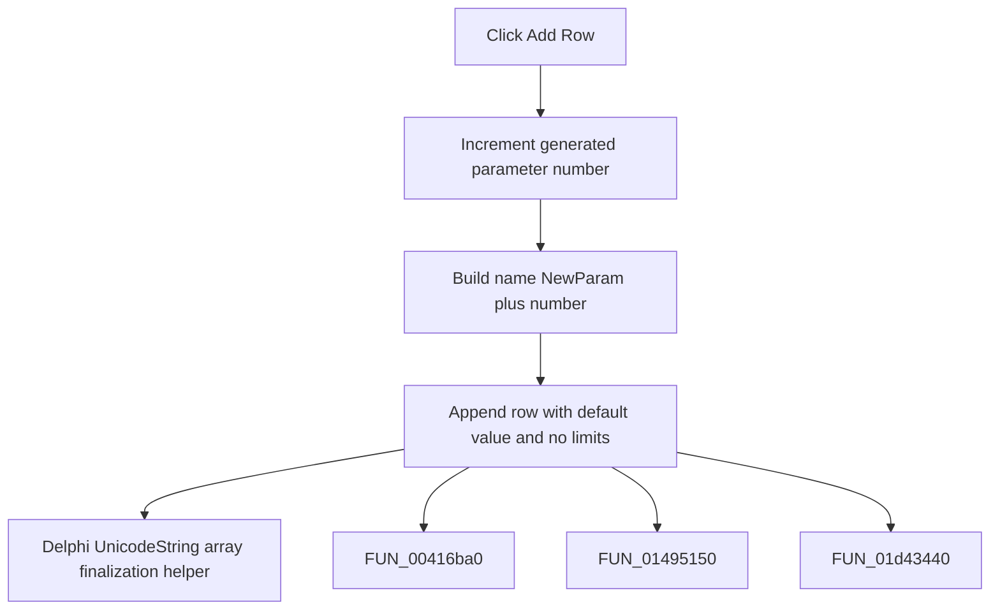

# Add Row

> Analysis status: Complete. The command appends a default parameter row.

## Control

| Property | Recovered value |
| --- | --- |
| Form | frmDesignTool |
| Component path | frmDesignTool.SimplePanel.sbAddRow |
| Control class | TBitBtn |
| Caption | Add Row |
| Hint | Not present in the recovered resource. |
| Text | Not present in the recovered resource. |
| Handler name | sbAddRowClick |
| Handler address | 014953c0 |
| Graph node | `resource:dfm:frmDesignTool/frmDesignTool.SimplePanel.sbAddRow` |
| Handler node | `function:014953c0` |
| Graph layer | UI |

## What happens when clicked

The handler increments the generated-name counter, builds `NewParam` plus that number, and appends a parameter-grid row. The new row uses the recovered default value text and sets both the minimum and maximum fields to `<none>`. It also advances the current row count.

## Click flow

## Handler evidence

- Source: [DecompiledSources/Tina16/functions/00000000014953C0__FUN_014953c0.c](../../../DecompiledSources/Tina16/functions/00000000014953C0__FUN_014953c0.c)
- Recovered role: Not present in the recovered resource.
- Current graph summary: Handles 1 Delphi UI event: frmDesignTool.SimplePanel.sbAddRow.OnClick.
- Current graph behavior: Not present in the recovered resource.
- Current graph evidence: Not present in the recovered resource.
- Complexity: complex
- Distinct outgoing calls: 4

## Direct calls

- `function:00414560` — Delphi UnicodeString array finalization helper
- `function:00416ba0` — FUN_00416ba0
- `function:01495150` — FUN_01495150
- `function:01d43440` — FUN_01d43440

## Resource evidence

- Kind: Not present in the recovered resource.
- Modal result: Not present in the recovered resource.
- Checked state: Not present in the recovered resource.
- List items: Not present in the recovered resource.
- Image reference: Not present in the recovered resource.
- Extracted glyph: None.

## Nearby label candidates

Nearby labels are layout candidates only. They are not proof of behavior.

- Rank 1: Input Parameters: at distance 243.
- Rank 2: Title at distance 291.

## Analysis limits

- Do not infer behavior from the control class, caption, hint, glyph, or nearby label alone.
- The recovered source does not validate the generated name at insertion time.
