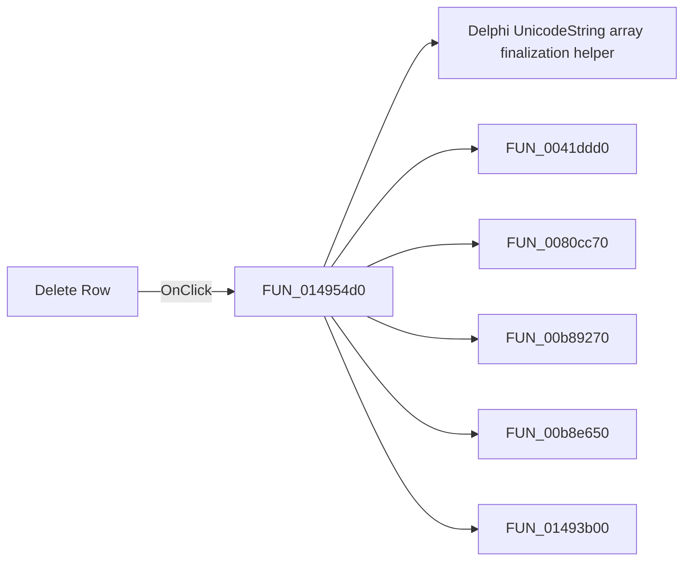

# Delete Row

> Analysis status: Pending individual source review.

## Control

| Property | Recovered value |
| --- | --- |
| Form | frmDesignTool |
| Component path | frmDesignTool.SimplePanel.sbDeleteRow |
| Control class | TBitBtn |
| Caption | Delete Row |
| Hint | Not present in the recovered resource. |
| Text | Not present in the recovered resource. |
| Handler name | sbDeleteRowClick |
| Handler address | 014954d0 |
| Graph node | `resource:dfm:frmDesignTool/frmDesignTool.SimplePanel.sbDeleteRow` |
| Handler node | `function:014954d0` |
| Graph layer | UI |

## What happens when clicked

Pending individual analysis. An agent must read the recovered handler source and its relevant callees before it replaces this text.

## Click flow

## Handler evidence

- Source: [DecompiledSources/Tina16/functions/00000000014954D0__FUN_014954d0.c](../../../DecompiledSources/Tina16/functions/00000000014954D0__FUN_014954d0.c)
- Recovered role: Not present in the recovered resource.
- Current graph summary: Handles 1 Delphi UI event: frmDesignTool.SimplePanel.sbDeleteRow.OnClick.
- Current graph behavior: Not present in the recovered resource.
- Current graph evidence: Not present in the recovered resource.
- Complexity: complex
- Distinct outgoing calls: 8

## Direct calls

- `function:00414560` — Delphi UnicodeString array finalization helper
- `function:0041ddd0` — FUN_0041ddd0
- `function:0080cc70` — FUN_0080cc70
- `function:00b89270` — FUN_00b89270
- `function:00b8e650` — FUN_00b8e650
- `function:01493b00` — FUN_01493b00
- `function:01493b70` — FUN_01493b70
- `function:014952d0` — FUN_014952d0

## Resource evidence

- Kind: Not present in the recovered resource.
- Modal result: Not present in the recovered resource.
- Checked state: Not present in the recovered resource.
- List items: Not present in the recovered resource.
- Image reference: Not present in the recovered resource.
- Extracted glyph: None.

## Nearby label candidates

Nearby labels are layout candidates only. They are not proof of behavior.

- Rank 1: Input Parameters: at distance 339.
- Rank 2: Title at distance 397.

## Analysis limits

- Do not infer behavior from the control class, caption, hint, glyph, or nearby label alone.
- Do not replace the pending status until the handler source and relevant call path provide enough evidence.
