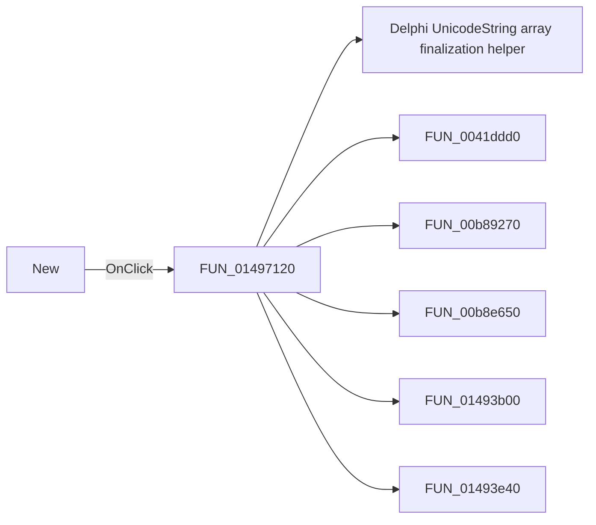

# New

> Analysis status: Pending individual source review.

## Control

| Property | Recovered value |
| --- | --- |
| Form | frmDesignTool |
| Component path | frmDesignTool.AdvancedPanel.gbInterpreter.pnPanelInterpreter.pnToolPanel.sbFileNew |
| Control class | TSpeedButton |
| Caption | Not present in the recovered resource. |
| Hint | New |
| Text | Not present in the recovered resource. |
| Handler name | sbFileNewClick |
| Handler address | 01497120 |
| Graph node | `resource:dfm:frmDesignTool/frmDesignTool.AdvancedPanel.gbInterpreter.pnPanelInterpreter.pnToolPanel.sbFileNew` |
| Handler node | `function:01497120` |
| Graph layer | UI |

## What happens when clicked

Pending individual analysis. An agent must read the recovered handler source and its relevant callees before it replaces this text.

## Click flow

## Handler evidence

- Source: [DecompiledSources/Tina16/functions/0000000001497120__FUN_01497120.c](../../../DecompiledSources/Tina16/functions/0000000001497120__FUN_01497120.c)
- Recovered role: Not present in the recovered resource.
- Current graph summary: Handles 1 Delphi UI event: frmDesignTool.AdvancedPanel.gbInterpreter.pnPanelInterpreter.pnToolPanel.sbFileNew.OnClick.
- Current graph behavior: Not present in the recovered resource.
- Current graph evidence: Not present in the recovered resource.
- Complexity: complex
- Distinct outgoing calls: 6

## Direct calls

- `function:00414560` — Delphi UnicodeString array finalization helper
- `function:0041ddd0` — FUN_0041ddd0
- `function:00b89270` — FUN_00b89270
- `function:00b8e650` — FUN_00b8e650
- `function:01493b00` — FUN_01493b00
- `function:01493e40` — FUN_01493e40

## Resource evidence

- Kind: Not present in the recovered resource.
- Modal result: Not present in the recovered resource.
- Checked state: Not present in the recovered resource.
- List items: Not present in the recovered resource.
- Image reference: Not present in the recovered resource.
- Extracted glyph: [`0179_frmDesignTool_frmDesignTool_AdvancedPanel_gbInterpreter_pnPanelInterpreter_pnToolPanel_sbFileNew_Glyph_Data.png`](../../../glyph/0179_frmDesignTool_frmDesignTool_AdvancedPanel_gbInterpreter_pnPanelInterpreter_pnToolPanel_sbFileNew_Glyph_Data.png)

## Nearby label candidates

Nearby labels are layout candidates only. They are not proof of behavior.

- No same-parent label candidate is available.

## Analysis limits

- Do not infer behavior from the control class, caption, hint, glyph, or nearby label alone.
- Do not replace the pending status until the handler source and relevant call path provide enough evidence.
