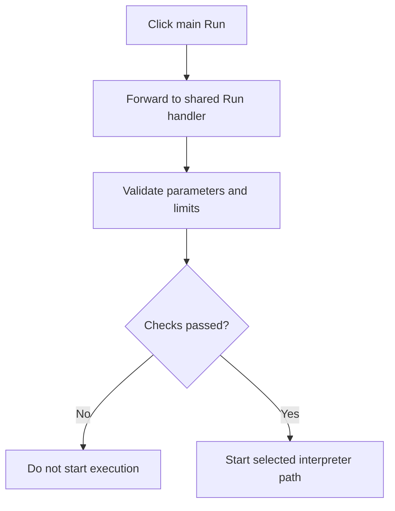

# Run

> Analysis status: Complete. This main-panel Run button forwards to the advanced Run handler.

## Control

| Property | Recovered value |
| --- | --- |
| Form | frmDesignTool |
| Component path | frmDesignTool.SimplePanel.sbMainRun |
| Control class | TSpeedButton |
| Caption | Not present in the recovered resource. |
| Hint | Run |
| Text | Not present in the recovered resource. |
| Handler name | sbMainRunClick |
| Handler address | 01498bd0 |
| Graph node | `resource:dfm:frmDesignTool/frmDesignTool.SimplePanel.sbMainRun` |
| Handler node | `function:01498bd0` |
| Graph layer | UI |

## What happens when clicked

The handler calls `FUN_01496950` without adding a branch or changing state first. The shared handler applies the license warning where applicable, validates parameters and limits, selects the current interpreter path, and starts execution only when the checks pass. The resource uses the same green-triangle glyph as the advanced Run control.

## Click flow

## Handler evidence

- Source: [DecompiledSources/Tina16/functions/0000000001498BD0__FUN_01498bd0.c](../../../DecompiledSources/Tina16/functions/0000000001498BD0__FUN_01498bd0.c)
- Recovered role: Not present in the recovered resource.
- Current graph summary: Handles 1 Delphi UI event: frmDesignTool.SimplePanel.sbMainRun.OnClick.
- Current graph behavior: Not present in the recovered resource.
- Current graph evidence: Not present in the recovered resource.
- Complexity: simple
- Distinct outgoing calls: 1

## Direct calls

- `function:01496950` — Handles 1 Delphi UI event: frmDesignTool.AdvancedPanel.gbInterpreter.pnPanelInterpreter.pnToolPanel.sbRun.OnClick.

## Resource evidence

- Kind: Not present in the recovered resource.
- Modal result: Not present in the recovered resource.
- Checked state: Not present in the recovered resource.
- List items: Not present in the recovered resource.
- Image reference: Not present in the recovered resource.
- Extracted glyph: [`0178_frmDesignTool_frmDesignTool_SimplePanel_sbMainRun_Glyph_Data.png`](../../../glyph/0178_frmDesignTool_frmDesignTool_SimplePanel_sbMainRun_Glyph_Data.png)

## Nearby label candidates

Nearby labels are layout candidates only. They are not proof of behavior.

- Rank 1: Input Parameters: at distance 572.
- Rank 2: Title at distance 630.

## Analysis limits

- Do not infer behavior from the control class, caption, hint, glyph, or nearby label alone.
- This forwarding handler has no independent error or no-op behavior.
