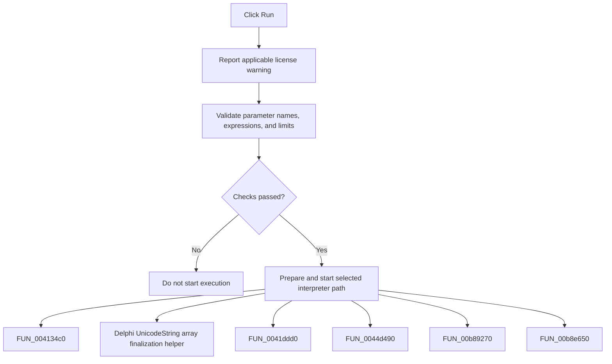

# Run

> Analysis status: Complete. The command validates parameters and starts the selected interpreter path.

## Control

| Property | Recovered value |
| --- | --- |
| Form | frmDesignTool |
| Component path | frmDesignTool.AdvancedPanel.gbInterpreter.pnPanelInterpreter.pnToolPanel.sbRun |
| Control class | TSpeedButton |
| Caption | Not present in the recovered resource. |
| Hint | Run |
| Text | Not present in the recovered resource. |
| Handler name | sbRunClick |
| Handler address | 01496950 |
| Graph node | `resource:dfm:frmDesignTool/frmDesignTool.AdvancedPanel.gbInterpreter.pnPanelInterpreter.pnToolPanel.sbRun` |
| Handler node | `function:01496950` |
| Graph layer | UI |

## What happens when clicked

The handler reports the recovered license warning when an unlicensed editor contains more than 100 lines; that warning does not stop the remaining path. It validates parameter names, duplicate names, expressions, and min/max limits. Interface mode `1` prepares parameter data and starts its execution path. The other mode uses the alternate preparation path with run mode `2`. A failed validation stops execution.

## Click flow

## Handler evidence

- Source: [DecompiledSources/Tina16/functions/0000000001496950__FUN_01496950.c](../../../DecompiledSources/Tina16/functions/0000000001496950__FUN_01496950.c)
- Recovered role: Not present in the recovered resource.
- Current graph summary: Handles 1 Delphi UI event: frmDesignTool.AdvancedPanel.gbInterpreter.pnPanelInterpreter.pnToolPanel.sbRun.OnClick.
- Current graph behavior: Not present in the recovered resource.
- Current graph evidence: Not present in the recovered resource.
- Complexity: complex
- Distinct outgoing calls: 13

## Direct calls

- `function:004134c0` — FUN_004134c0
- `function:00414560` — Delphi UnicodeString array finalization helper
- `function:0041ddd0` — FUN_0041ddd0
- `function:0044d490` — FUN_0044d490
- `function:00b89270` — FUN_00b89270
- `function:00b8e650` — FUN_00b8e650
- `function:01496b50` — FUN_01496b50
- `function:01496ea0` — FUN_01496ea0
- `function:01497210` — FUN_01497210
- `function:01499d20` — FUN_01499d20
- `function:01499f60` — FUN_01499f60
- `function:019a4600` — FUN_019a4600
- `function:01b23030` — FUN_01b23030

## Resource evidence

- Kind: Not present in the recovered resource.
- Modal result: Not present in the recovered resource.
- Checked state: Not present in the recovered resource.
- List items: Not present in the recovered resource.
- Image reference: Not present in the recovered resource.
- Extracted glyph: [`0180_frmDesignTool_frmDesignTool_AdvancedPanel_gbInterpreter_pnPanelInterpreter_pnToolPanel_sbRun_Glyph_Data.png`](../../../glyph/0180_frmDesignTool_frmDesignTool_AdvancedPanel_gbInterpreter_pnPanelInterpreter_pnToolPanel_sbRun_Glyph_Data.png)

## Nearby label candidates

Nearby labels are layout candidates only. They are not proof of behavior.

- No same-parent label candidate is available.

## Analysis limits

- Do not infer behavior from the control class, caption, hint, glyph, or nearby label alone.
- The recovered source does not provide a Delphi enum name for the two interface modes.
