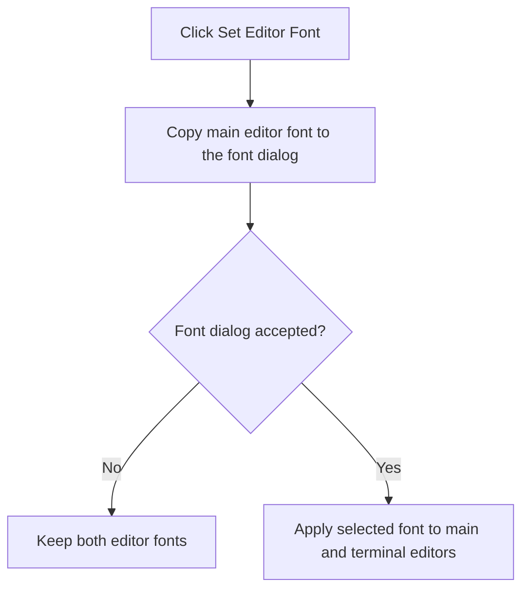

# F

> Analysis status: Complete. The command applies an accepted font selection to both editors.

## Control

| Property | Recovered value |
| --- | --- |
| Form | frmDesignTool |
| Component path | frmDesignTool.AdvancedPanel.gbInterpreter.pnPanelInterpreter.pnToolPanel.sbSetFont |
| Control class | TSpeedButton |
| Caption | F |
| Hint | Set Editor Font |
| Text | Not present in the recovered resource. |
| Handler name | sbSetFontClick |
| Handler address | 0149a5e0 |
| Graph node | `resource:dfm:frmDesignTool/frmDesignTool.AdvancedPanel.gbInterpreter.pnPanelInterpreter.pnToolPanel.sbSetFont` |
| Handler node | `function:0149a5e0` |
| Graph layer | UI |

## What happens when clicked

The handler copies the main editor font into the form's font dialog and executes the dialog. If the user accepts, it copies the selected font to the main editor and the terminal editor. If the user cancels, neither editor receives the dialog font. The caption **F** and hint **Set Editor Font** identify the control; the data flow proves the affected editors.

## Click flow

## Handler evidence

- Source: [DecompiledSources/Tina16/functions/000000000149A5E0__FUN_0149a5e0.c](../../../DecompiledSources/Tina16/functions/000000000149A5E0__FUN_0149a5e0.c)
- Recovered role: Not present in the recovered resource.
- Current graph summary: Handles 1 Delphi UI event: frmDesignTool.AdvancedPanel.gbInterpreter.pnPanelInterpreter.pnToolPanel.sbSetFont.OnClick.
- Current graph behavior: Not present in the recovered resource.
- Current graph evidence: Not present in the recovered resource.
- Complexity: simple
- Distinct outgoing calls: 1

## Direct calls

- `function:00bf2c10` — FUN_00bf2c10

## Resource evidence

- Kind: Not present in the recovered resource.
- Modal result: Not present in the recovered resource.
- Checked state: Not present in the recovered resource.
- List items: Not present in the recovered resource.
- Image reference: Not present in the recovered resource.
- Extracted glyph: None.

## Nearby label candidates

Nearby labels are layout candidates only. They are not proof of behavior.

- No same-parent label candidate is available.

## Analysis limits

- Do not infer behavior from the control class, caption, hint, glyph, or nearby label alone.
- The handler does not compare the selected font with the current font before it applies it.
