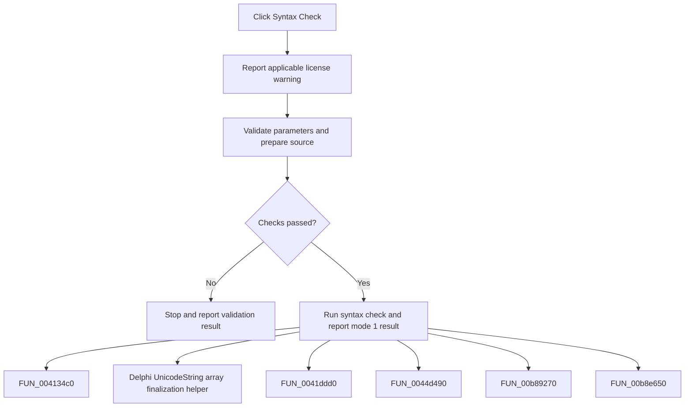

# Syntax Check

> Analysis status: Complete. The command validates the program and reports the syntax-check result.

## Control

| Property | Recovered value |
| --- | --- |
| Form | frmDesignTool |
| Component path | frmDesignTool.AdvancedPanel.gbInterpreter.pnPanelInterpreter.pnToolPanel.sbSyntaxCheck |
| Control class | TSpeedButton |
| Caption | Not present in the recovered resource. |
| Hint | Syntax Check |
| Text | Not present in the recovered resource. |
| Handler name | sbSyntaxCheckClick |
| Handler address | 0149a680 |
| Graph node | `resource:dfm:frmDesignTool/frmDesignTool.AdvancedPanel.gbInterpreter.pnPanelInterpreter.pnToolPanel.sbSyntaxCheck` |
| Handler node | `function:0149a680` |
| Graph layer | UI |

## What happens when clicked

The handler applies the same recovered line-count license warning as Run, then checks whether the current interface can be processed. In interface mode `1`, it reads the editor text, initializes the program object, transfers parameter values, prepares the program in check mode, and reports the result with mode `1`. The other interface uses the alternate check path, also with mode `1`. Invalid parameter names, expressions, or limits stop the check.

## Click flow

## Handler evidence

- Source: [DecompiledSources/Tina16/functions/000000000149A680__FUN_0149a680.c](../../../DecompiledSources/Tina16/functions/000000000149A680__FUN_0149a680.c)
- Recovered role: Not present in the recovered resource.
- Current graph summary: Handles 1 Delphi UI event: frmDesignTool.AdvancedPanel.gbInterpreter.pnPanelInterpreter.pnToolPanel.sbSyntaxCheck.OnClick.
- Current graph behavior: Not present in the recovered resource.
- Current graph evidence: Not present in the recovered resource.
- Complexity: complex
- Distinct outgoing calls: 13

## Direct calls

- `function:004134c0` — FUN_004134c0
- `function:00414560` — Delphi UnicodeString array finalization helper
- `function:0041ddd0` — FUN_0041ddd0
- `function:0044d490` — FUN_0044d490
- `function:00b89270` — FUN_00b89270
- `function:00b8e650` — FUN_00b8e650
- `function:013b9dc0` — FUN_013b9dc0
- `function:013bc030` — FUN_013bc030
- `function:014959c0` — FUN_014959c0
- `function:01496ea0` — FUN_01496ea0
- `function:0149b690` — FUN_0149b690
- `function:019a4600` — FUN_019a4600
- `function:01b23030` — FUN_01b23030

## Resource evidence

- Kind: Not present in the recovered resource.
- Modal result: Not present in the recovered resource.
- Checked state: Not present in the recovered resource.
- List items: Not present in the recovered resource.
- Image reference: Not present in the recovered resource.
- Extracted glyph: [`0181_frmDesignTool_frmDesignTool_AdvancedPanel_gbInterpreter_pnPanelInterpreter_pnToolPanel_sbSyntaxCheck_Glyph_Data.png`](../../../glyph/0181_frmDesignTool_frmDesignTool_AdvancedPanel_gbInterpreter_pnPanelInterpreter_pnToolPanel_sbSyntaxCheck_Glyph_Data.png)

## Nearby label candidates

Nearby labels are layout candidates only. They are not proof of behavior.

- No same-parent label candidate is available.

## Analysis limits

- Do not infer behavior from the control class, caption, hint, glyph, or nearby label alone.
- The exact presentation of the final result is inside the shared result handler.
