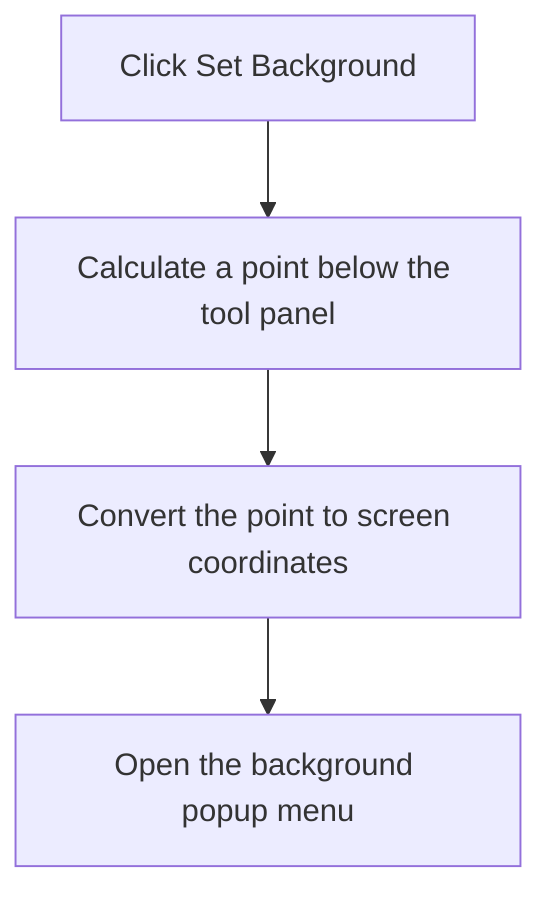

# Set Background

> Analysis status: Complete. The recovered handler opens the background popup at a point below the tool panel.

## Control

| Property | Recovered value |
| --- | --- |
| Form | frmDesignTool |
| Component path | frmDesignTool.AdvancedPanel.gbInterpreter.pnPanelInterpreter.pnToolPanel.SetBackground |
| Control class | TSpeedButton |
| Caption | Not present in the recovered resource. |
| Hint | Set Background |
| Text | Not present in the recovered resource. |
| Handler name | SetBackgroundClick |
| Handler address | 01493a30 |
| Graph node | `resource:dfm:frmDesignTool/frmDesignTool.AdvancedPanel.gbInterpreter.pnPanelInterpreter.pnToolPanel.SetBackground` |
| Handler node | `function:01493a30` |
| Graph layer | UI |

## What happens when clicked

The handler clears a popup state byte, calculates a point two pixels below the tool panel, converts that point to screen coordinates, and opens the background popup at that position. The popup commands make the actual background and border changes. The small down-arrow glyph agrees with this popup action but is not the primary evidence.

## Click flow

## Handler evidence

- Source: [DecompiledSources/Tina16/functions/0000000001493A30__FUN_01493a30.c](../../../DecompiledSources/Tina16/functions/0000000001493A30__FUN_01493a30.c)
- Recovered role: Not present in the recovered resource.
- Current graph summary: Handles 1 Delphi UI event: frmDesignTool.AdvancedPanel.gbInterpreter.pnPanelInterpreter.pnToolPanel.SetBackground.OnClick.
- Current graph behavior: Not present in the recovered resource.
- Current graph evidence: Not present in the recovered resource.
- Complexity: moderate
- Distinct outgoing calls: 2

## Direct calls

- `function:00498310` — FUN_00498310
- `function:0064d1f0` — FUN_0064d1f0

## Resource evidence

- Kind: Not present in the recovered resource.
- Modal result: Not present in the recovered resource.
- Checked state: Not present in the recovered resource.
- List items: Not present in the recovered resource.
- Image reference: Not present in the recovered resource.
- Extracted glyph: [`0182_frmDesignTool_frmDesignTool_AdvancedPanel_gbInterpreter_pnPanelInterpreter_pnToolPanel_SetBackground_Glyph_Data.png`](../../../glyph/0182_frmDesignTool_frmDesignTool_AdvancedPanel_gbInterpreter_pnPanelInterpreter_pnToolPanel_SetBackground_Glyph_Data.png)

## Nearby label candidates

Nearby labels are layout candidates only. They are not proof of behavior.

- No same-parent label candidate is available.

## Analysis limits

- Do not infer behavior from the control class, caption, hint, glyph, or nearby label alone.
- This click does not change the background or border by itself. A later popup-menu command does that work.
