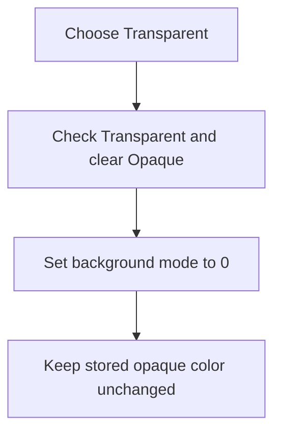

# Transparent

> Analysis status: Complete. The command selects transparent background mode.

## Control

| Property | Recovered value |
| --- | --- |
| Form | frmDesignTool |
| Component path | frmDesignTool.pmBackground.Background1.TransparentMnu |
| Control class | TMenuItem |
| Caption | Transparent |
| Hint | Not present in the recovered resource. |
| Text | Not present in the recovered resource. |
| Handler name | TransparentMnuClick |
| Handler address | 0149a870 |
| Graph node | `resource:dfm:frmDesignTool/frmDesignTool.pmBackground.Background1.TransparentMnu` |
| Handler node | `function:0149a870` |
| Graph layer | UI |

## What happens when clicked

The handler checks **Transparent**, unchecks **Opaque...**, and writes background mode `0` to form field `+0xbd0`. It does not open a color dialog or change the saved opaque color at `+0xbd4`. Repeated selection is idempotent apart from the menu setter's normal state publication.

## Click flow

## Handler evidence

- Source: [DecompiledSources/Tina16/functions/000000000149A870__FUN_0149a870.c](../../../DecompiledSources/Tina16/functions/000000000149A870__FUN_0149a870.c)
- Recovered role: Not present in the recovered resource.
- Current graph summary: Handles 1 Delphi UI event: frmDesignTool.pmBackground.Background1.TransparentMnu.OnClick.
- Current graph behavior: Not present in the recovered resource.
- Current graph evidence: Not present in the recovered resource.
- Complexity: simple
- Distinct outgoing calls: 1

## Direct calls

- `function:007e2d20` — FUN_007e2d20

## Resource evidence

- Kind: Not present in the recovered resource.
- Modal result: Not present in the recovered resource.
- Checked state: Not present in the recovered resource.
- List items: Not present in the recovered resource.
- Image reference: Not present in the recovered resource.
- Extracted glyph: None.

## Nearby label candidates

Nearby labels are layout candidates only. They are not proof of behavior.

- No same-parent label candidate is available.

## Analysis limits

- Do not infer behavior from the control class, caption, hint, glyph, or nearby label alone.
- This handler does not directly repaint the editor or clear the stored color.
