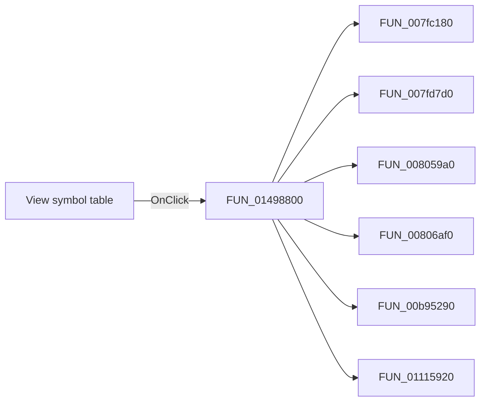

# View symbol table

> Analysis status: Pending individual source review.

## Control

| Property | Recovered value |
| --- | --- |
| Form | frmDesignTool |
| Component path | frmDesignTool.mnMainMenu.mnSettings.Viewsymboltable1 |
| Control class | TMenuItem |
| Caption | View symbol table |
| Hint | Not present in the recovered resource. |
| Text | Not present in the recovered resource. |
| Handler name | Viewsymboltable1Click |
| Handler address | 01498800 |
| Graph node | `resource:dfm:frmDesignTool/frmDesignTool.mnMainMenu.mnSettings.Viewsymboltable1` |
| Handler node | `function:01498800` |
| Graph layer | UI |

## What happens when clicked

Pending individual analysis. An agent must read the recovered handler source and its relevant callees before it replaces this text.

## Click flow

## Handler evidence

- Source: [DecompiledSources/Tina16/functions/0000000001498800__FUN_01498800.c](../../../DecompiledSources/Tina16/functions/0000000001498800__FUN_01498800.c)
- Recovered role: Not present in the recovered resource.
- Current graph summary: Handles 1 Delphi UI event: frmDesignTool.mnMainMenu.mnSettings.Viewsymboltable1.OnClick.
- Current graph behavior: Not present in the recovered resource.
- Current graph evidence: Not present in the recovered resource.
- Complexity: complex
- Distinct outgoing calls: 9

## Direct calls

- `function:007fc180` — FUN_007fc180
- `function:007fd7d0` — FUN_007fd7d0
- `function:008059a0` — FUN_008059a0
- `function:00806af0` — FUN_00806af0
- `function:00b95290` — FUN_00b95290
- `function:01115920` — FUN_01115920
- `function:01115c40` — FUN_01115c40
- `function:01694110` — FUN_01694110
- `function:016942f0` — FUN_016942f0

## Resource evidence

- Kind: Not present in the recovered resource.
- Modal result: Not present in the recovered resource.
- Checked state: Not present in the recovered resource.
- List items: Not present in the recovered resource.
- Image reference: Not present in the recovered resource.
- Extracted glyph: None.

## Nearby label candidates

Nearby labels are layout candidates only. They are not proof of behavior.

- No same-parent label candidate is available.

## Analysis limits

- Do not infer behavior from the control class, caption, hint, glyph, or nearby label alone.
- Do not replace the pending status until the handler source and relevant call path provide enough evidence.
