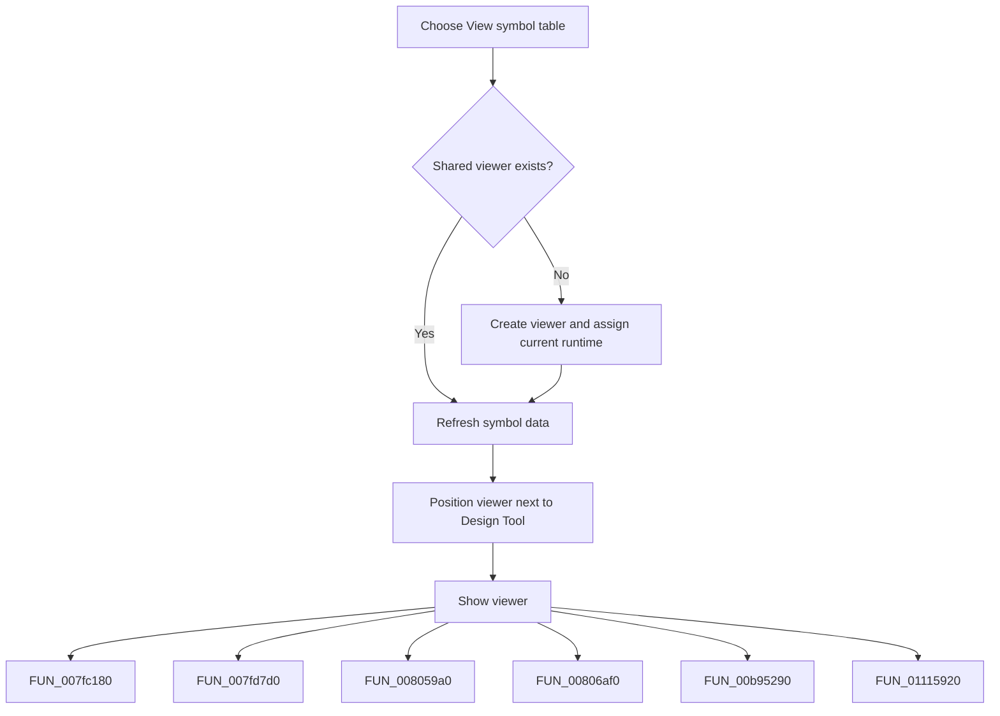

# View symbol table

> Analysis status: Complete. The command creates or refreshes the shared symbol-table viewer and shows it next to the Design Tool.

## Control

| Property | Recovered value |
| --- | --- |
| Form | frmDesignTool |
| Component path | frmDesignTool.mnMainMenu.mnSettings.Viewsymboltable1 |
| Control class | TMenuItem |
| Caption | View symbol table |
| Hint | Not present in the recovered resource. |
| Text | Not present in the recovered resource. |
| Handler name | Viewsymboltable1Click |
| Handler address | 01498800 |
| Graph node | `resource:dfm:frmDesignTool/frmDesignTool.mnMainMenu.mnSettings.Viewsymboltable1` |
| Handler node | `function:01498800` |
| Graph layer | UI |

## What happens when clicked

If the shared symbol-table form does not exist, the handler creates it and assigns the current interpreter runtime. It then clears and repopulates symbol data, refreshes the viewer, positions it relative to the Design Tool form, and shows it. Later clicks reuse the same viewer instance and refresh its content.

## Click flow

## Handler evidence

- Source: [DecompiledSources/Tina16/functions/0000000001498800__FUN_01498800.c](../../../DecompiledSources/Tina16/functions/0000000001498800__FUN_01498800.c)
- Recovered role: Not present in the recovered resource.
- Current graph summary: Handles 1 Delphi UI event: frmDesignTool.mnMainMenu.mnSettings.Viewsymboltable1.OnClick.
- Current graph behavior: Not present in the recovered resource.
- Current graph evidence: Not present in the recovered resource.
- Complexity: complex
- Distinct outgoing calls: 9

## Direct calls

- `function:007fc180` — FUN_007fc180
- `function:007fd7d0` — FUN_007fd7d0
- `function:008059a0` — FUN_008059a0
- `function:00806af0` — FUN_00806af0
- `function:00b95290` — FUN_00b95290
- `function:01115920` — FUN_01115920
- `function:01115c40` — FUN_01115c40
- `function:01694110` — FUN_01694110
- `function:016942f0` — FUN_016942f0

## Resource evidence

- Kind: Not present in the recovered resource.
- Modal result: Not present in the recovered resource.
- Checked state: Not present in the recovered resource.
- List items: Not present in the recovered resource.
- Image reference: Not present in the recovered resource.
- Extracted glyph: None.

## Nearby label candidates

Nearby labels are layout candidates only. They are not proof of behavior.

- No same-parent label candidate is available.

## Analysis limits

- Do not infer behavior from the control class, caption, hint, glyph, or nearby label alone.
- The recovered source does not prove whether a previously hidden viewer keeps user-resized dimensions.
