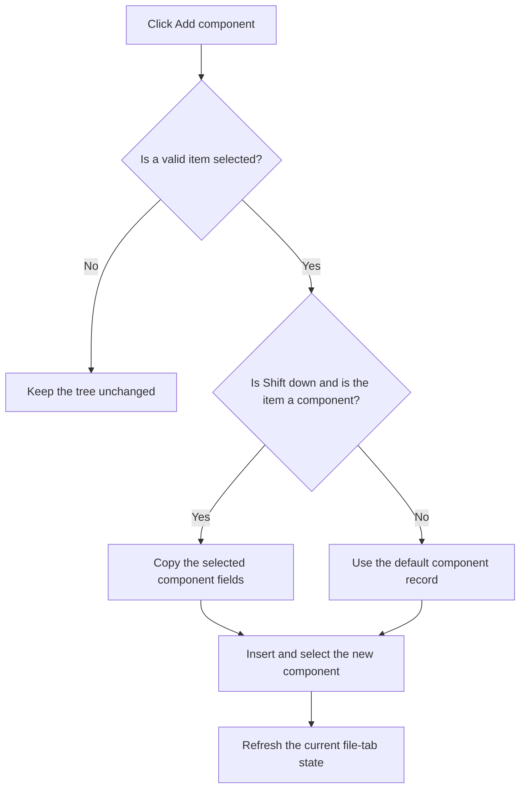

# Add &component

> Analysis status: Reviewed against the recovered shared handler and sender branch.

## Control

| Property | Recovered value |
| --- | --- |
| Form | frmEditCompRack |
| Component path | frmEditCompRack.pnlToolBar.btnAdd |
| Control class | TButton |
| Caption | Add &component |
| Hint | Add component\|Shift+Click will duplicate the currently selected component |
| Text | Not present in the recovered resource. |
| Handler name | btnAddClick |
| Handler address | 01b98160 |
| Graph node | `resource:dfm:frmEditCompRack/frmEditCompRack.pnlToolBar.btnAdd` |
| Handler node | `function:01b98160` |
| Graph layer | UI |

## What happens when clicked

The shared handler first requires a selected tree item and valid current editor values. A normal click creates a component from the recovered default component record. A Shift+click copies the selected component's name, secondary value, and type. If the selected item is a group, the handler uses the default record even when Shift is down. It inserts the new record in the selected tree context, assigns its icon index, selects it, and refreshes the current file-tab state.

## Click flow

## Handler evidence

- Source: [DecompiledSources/Tina16/functions/0000000001B98160__FUN_01b98160.c](../../../DecompiledSources/Tina16/functions/0000000001B98160__FUN_01b98160.c)
- Recovered role: Adds a default or duplicate Component Bar component according to the sender and Shift state.
- Current graph summary: Handles 2 Delphi UI events: frmEditCompRack.pnlToolBar.btnAdd.OnClick, frmEditCompRack.pmnuNav.mnDuplicate.OnClick.
- Current graph behavior: Requires a selected item and valid editor state. The Duplicate sender forces the copy branch and rejects group items. The toolbar sender copies only with Shift; otherwise it builds the default component. Both branches insert, select, and mark the new item.
- Current graph evidence: The handler compares `Sender` with the menu-item field, tests group records with `FUN_01b95130` for leading `[`, otherwise tests Shift state, copies three fields from a component only in the duplicate branch, uses `DAT_02110dc8` in the default branch, inserts through `FUN_006dee70`, sets the icon index, and selects the returned item with `FUN_01b97960`.
- Complexity: complex
- Distinct outgoing calls: 17

## Direct calls

- `function:00414560` — Delphi UnicodeString array finalization helper
- `function:00414b50` — FUN_00414b50
- `function:0064dbe0` — FUN_0064dbe0
- `function:006d5120` — FUN_006d5120
- `function:006d6380` — FUN_006d6380
- `function:006dcbd0` — FUN_006dcbd0
- `function:006dcca0` — FUN_006dcca0
- `function:006dd390` — FUN_006dd390
- `function:006dd6f0` — FUN_006dd6f0
- `function:006dee70` — FUN_006dee70
- `function:006e2530` — FUN_006e2530
- `function:00c85dd0` — FUN_00c85dd0
- `function:01b1cbc0` — FUN_01b1cbc0
- `function:01b95080` — FUN_01b95080
- `function:01b95130` — FUN_01b95130
- `function:01b96a50` — FUN_01b96a50
- `function:01b97960` — FUN_01b97960

## Resource evidence

- Kind: Not present in the recovered resource.
- Modal result: Not present in the recovered resource.
- Checked state: Not present in the recovered resource.
- List items: Not present in the recovered resource.
- Image reference: Not present in the recovered resource.
- Extracted glyph: None.

## Nearby label candidates

Nearby labels are layout candidates only. They are not proof of behavior.

- No same-parent label candidate is available.

## Analysis limits

- The recovered source does not expose a Delphi name for the serialized component-record type.
