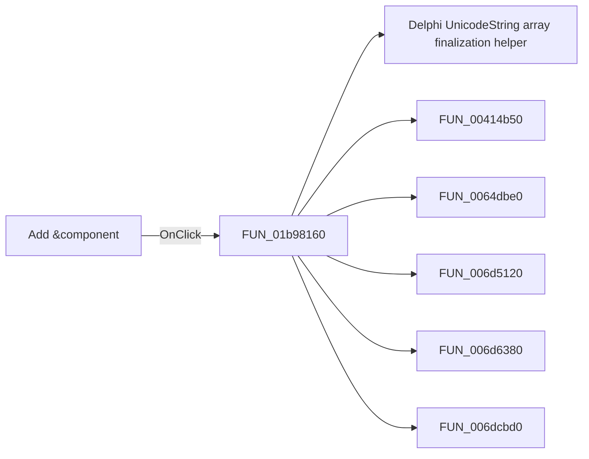

# Add &component

> Analysis status: Pending individual source review.

## Control

| Property | Recovered value |
| --- | --- |
| Form | frmEditCompRack |
| Component path | frmEditCompRack.pnlToolBar.btnAdd |
| Control class | TButton |
| Caption | Add &component |
| Hint | Add component\|Shift+Click will duplicate the currently selected component |
| Text | Not present in the recovered resource. |
| Handler name | btnAddClick |
| Handler address | 01b98160 |
| Graph node | `resource:dfm:frmEditCompRack/frmEditCompRack.pnlToolBar.btnAdd` |
| Handler node | `function:01b98160` |
| Graph layer | UI |

## What happens when clicked

Pending individual analysis. An agent must read the recovered handler source and its relevant callees before it replaces this text.

## Click flow

## Handler evidence

- Source: [DecompiledSources/Tina16/functions/0000000001B98160__FUN_01b98160.c](../../../DecompiledSources/Tina16/functions/0000000001B98160__FUN_01b98160.c)
- Recovered role: Not present in the recovered resource.
- Current graph summary: Handles 2 Delphi UI events: frmEditCompRack.pnlToolBar.btnAdd.OnClick, frmEditCompRack.pmnuNav.mnDuplicate.OnClick.
- Current graph behavior: Not present in the recovered resource.
- Current graph evidence: Not present in the recovered resource.
- Complexity: complex
- Distinct outgoing calls: 17

## Direct calls

- `function:00414560` — Delphi UnicodeString array finalization helper
- `function:00414b50` — FUN_00414b50
- `function:0064dbe0` — FUN_0064dbe0
- `function:006d5120` — FUN_006d5120
- `function:006d6380` — FUN_006d6380
- `function:006dcbd0` — FUN_006dcbd0
- `function:006dcca0` — FUN_006dcca0
- `function:006dd390` — FUN_006dd390
- `function:006dd6f0` — FUN_006dd6f0
- `function:006dee70` — FUN_006dee70
- `function:006e2530` — FUN_006e2530
- `function:00c85dd0` — FUN_00c85dd0
- `function:01b1cbc0` — FUN_01b1cbc0
- `function:01b95080` — FUN_01b95080
- `function:01b95130` — FUN_01b95130
- `function:01b96a50` — FUN_01b96a50
- `function:01b97960` — FUN_01b97960

## Resource evidence

- Kind: Not present in the recovered resource.
- Modal result: Not present in the recovered resource.
- Checked state: Not present in the recovered resource.
- List items: Not present in the recovered resource.
- Image reference: Not present in the recovered resource.
- Extracted glyph: None.

## Nearby label candidates

Nearby labels are layout candidates only. They are not proof of behavior.

- No same-parent label candidate is available.

## Analysis limits

- Do not infer behavior from the control class, caption, hint, glyph, or nearby label alone.
- Do not replace the pending status until the handler source and relevant call path provide enough evidence.
