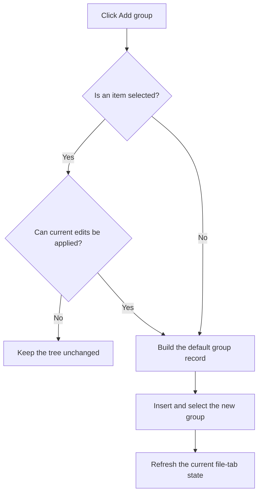

# Add &group

> Analysis status: Reviewed against the recovered handler and call path.

## Control

| Property | Recovered value |
| --- | --- |
| Form | frmEditCompRack |
| Component path | frmEditCompRack.pnlToolBar.btnAddGroup |
| Control class | TButton |
| Caption | Add &group |
| Hint | Add group |
| Text | Not present in the recovered resource. |
| Handler name | btnAddGroupClick |
| Handler address | 01b98650 |
| Graph node | `resource:dfm:frmEditCompRack/frmEditCompRack.pnlToolBar.btnAddGroup` |
| Handler node | `function:01b98650` |
| Graph layer | UI |

## What happens when clicked

If a tree item is selected, the handler first applies and validates its current editor values. It stops if that operation fails. It then hides the new-file panel, builds a group from the recovered default group record, inserts the group in the tree model, assigns no component icon to the new group, selects it, and refreshes the current file-tab state. The handler can add a group when no item is selected.

## Click flow

## Handler evidence

- Source: [DecompiledSources/Tina16/functions/0000000001B98650__FUN_01b98650.c](../../../DecompiledSources/Tina16/functions/0000000001B98650__FUN_01b98650.c)
- Recovered role: Adds a default group to the Component Bar tree.
- Current graph summary: Handles 1 Delphi UI event: frmEditCompRack.pnlToolBar.btnAddGroup.OnClick.
- Current graph behavior: Validates a selected item when present, hides the new-file panel, creates a group from the default group record, inserts it, sets its image indexes to -1, selects it, and refreshes the current tab.
- Current graph evidence: The handler conditionally calls `FUN_01b96a50` for the selected node, calls `FUN_0064dbe0(panel, 0)`, derives the group value from `DAT_02110dd0`, constructs its record with `FUN_01b95080`, inserts it through `FUN_006def30`, assigns `0xffffffff` through the two image setters, and selects it with `FUN_01b97960`.
- Complexity: complex
- Distinct outgoing calls: 14

## Direct calls

- `function:00414480` — Delphi UnicodeString clear and finalization helper
- `function:0064dbe0` — FUN_0064dbe0
- `function:006d5120` — FUN_006d5120
- `function:006d6380` — FUN_006d6380
- `function:006dcbd0` — FUN_006dcbd0
- `function:006dcca0` — FUN_006dcca0
- `function:006dd6f0` — FUN_006dd6f0
- `function:006def30` — FUN_006def30
- `function:006df4b0` — FUN_006df4b0
- `function:006e2530` — FUN_006e2530
- `function:01b95080` — FUN_01b95080
- `function:01b950d0` — FUN_01b950d0
- `function:01b96a50` — FUN_01b96a50
- `function:01b97960` — FUN_01b97960

## Resource evidence

- Kind: Not present in the recovered resource.
- Modal result: Not present in the recovered resource.
- Checked state: Not present in the recovered resource.
- List items: Not present in the recovered resource.
- Image reference: Not present in the recovered resource.
- Extracted glyph: None.

## Nearby label candidates

Nearby labels are layout candidates only. They are not proof of behavior.

- No same-parent label candidate is available.

## Analysis limits

- The recovered source does not expose a Delphi name for the serialized group-record type.
