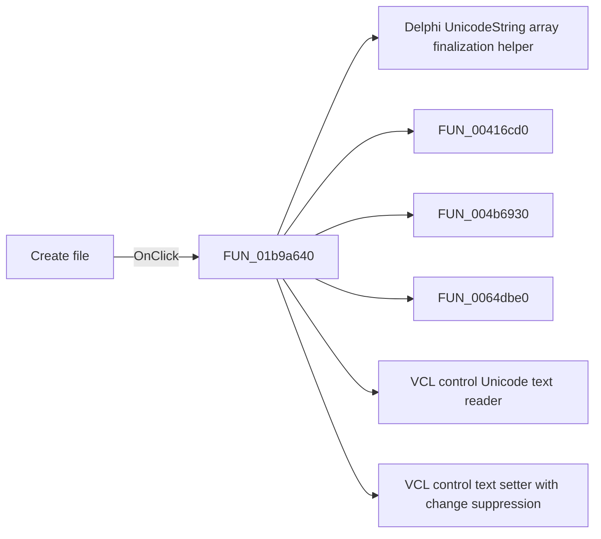

# Create file

> Analysis status: Pending individual source review.

## Control

| Property | Recovered value |
| --- | --- |
| Form | frmEditCompRack |
| Component path | frmEditCompRack.pnlBrowser.pnlBrowserShowIcons.pnlNewIni.btnCreateIni |
| Control class | TSpeedButton |
| Caption | Not present in the recovered resource. |
| Hint | Create file |
| Text | Not present in the recovered resource. |
| Handler name | btnCreateIniClick |
| Handler address | 01b9a640 |
| Graph node | `resource:dfm:frmEditCompRack/frmEditCompRack.pnlBrowser.pnlBrowserShowIcons.pnlNewIni.btnCreateIni` |
| Handler node | `function:01b9a640` |
| Graph layer | UI |

## What happens when clicked

Pending individual analysis. An agent must read the recovered handler source and its relevant callees before it replaces this text.

## Click flow

## Handler evidence

- Source: [DecompiledSources/Tina16/functions/0000000001B9A640__FUN_01b9a640.c](../../../DecompiledSources/Tina16/functions/0000000001B9A640__FUN_01b9a640.c)
- Recovered role: Not present in the recovered resource.
- Current graph summary: Handles 1 Delphi UI event: frmEditCompRack.pnlBrowser.pnlBrowserShowIcons.pnlNewIni.btnCreateIni.OnClick.
- Current graph behavior: Not present in the recovered resource.
- Current graph evidence: Not present in the recovered resource.
- Complexity: complex
- Distinct outgoing calls: 8

## Direct calls

- `function:00414560` — Delphi UnicodeString array finalization helper
- `function:00416cd0` — FUN_00416cd0
- `function:004b6930` — FUN_004b6930
- `function:0064dbe0` — FUN_0064dbe0
- `function:0064dd90` — VCL control Unicode text reader
- `function:0064de00` — VCL control text setter with change suppression
- `function:006d6380` — FUN_006d6380
- `function:01b9aa30` — Handles 1 Delphi UI event: frmEditCompRack.pnlBrowser.tctrlIniFiles.OnChange.

## Resource evidence

- Kind: Not present in the recovered resource.
- Modal result: Not present in the recovered resource.
- Checked state: Not present in the recovered resource.
- List items: Not present in the recovered resource.
- Image reference: Not present in the recovered resource.
- Extracted glyph: [`0183_frmEditCompRack_frmEditCompRack_pnlBrowser_pnlBrowserShowIcons_pnlNewIni_btnCreateIni_Glyph_Data.png`](../../../glyph/0183_frmEditCompRack_frmEditCompRack_pnlBrowser_pnlBrowserShowIcons_pnlNewIni_btnCreateIni_Glyph_Data.png)

## Nearby label candidates

Nearby labels are layout candidates only. They are not proof of behavior.

- Rank 1: Enter file name: at distance 263.

## Analysis limits

- Do not infer behavior from the control class, caption, hint, glyph, or nearby label alone.
- Do not replace the pending status until the handler source and relevant call path provide enough evidence.
