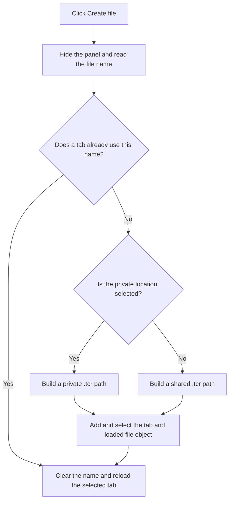

# Create file

> Analysis status: Reviewed against the recovered handler, resource, and glyph.

## Control

| Property | Recovered value |
| --- | --- |
| Form | frmEditCompRack |
| Component path | frmEditCompRack.pnlBrowser.pnlBrowserShowIcons.pnlNewIni.btnCreateIni |
| Control class | TSpeedButton |
| Caption | Not present in the recovered resource. |
| Hint | Create file |
| Text | Not present in the recovered resource. |
| Handler name | btnCreateIniClick |
| Handler address | 01b9a640 |
| Graph node | `resource:dfm:frmEditCompRack/frmEditCompRack.pnlBrowser.pnlBrowserShowIcons.pnlNewIni.btnCreateIni` |
| Handler node | `function:01b9a640` |
| Graph layer | UI |

## What happens when clicked

The handler first hides the new-file panel and reads the entered file name. If a tab with that name already exists, it does not add another file. Otherwise, it adds the name as a new tab, creates a loaded string-list object, and builds a `.tcr` path in the private or shared Component Bar directory according to the selected radio button. It associates that path and object with the new tab and selects it. In all cases, it clears the name field, shows the file tabs, and runs the tab-change handler to reload the editor. The recovered create-file glyph agrees with this operation.

## Click flow

## Handler evidence

- Source: [DecompiledSources/Tina16/functions/0000000001B9A640__FUN_01b9a640.c](../../../DecompiledSources/Tina16/functions/0000000001B9A640__FUN_01b9a640.c)
- Recovered role: Adds a private or shared Component Bar file tab.
- Current graph summary: Handles 1 Delphi UI event: frmEditCompRack.pnlBrowser.pnlBrowserShowIcons.pnlNewIni.btnCreateIni.OnClick.
- Current graph behavior: Rejects a duplicate tab name, otherwise adds a tab and backing object with a private or shared `.tcr` path, selects it, clears the input, shows the tabs, and reloads the editor.
- Current graph evidence: The handler reads `edNewIni`, calls the tab-list search virtual method, adds only when it returns -1, tests the private radio button at `0x870`, formats a path with the recovered `.tcr` literal and the corresponding global directory, inserts the loaded string-list object at the same index, selects the tab, clears `edNewIni`, shows the tab control, and calls `FUN_01b9aa30`, which calls the reset handler.
- Complexity: complex
- Distinct outgoing calls: 8

## Direct calls

- `function:00414560` — Delphi UnicodeString array finalization helper
- `function:00416cd0` — FUN_00416cd0
- `function:004b6930` — FUN_004b6930
- `function:0064dbe0` — FUN_0064dbe0
- `function:0064dd90` — VCL control Unicode text reader
- `function:0064de00` — VCL control text setter with change suppression
- `function:006d6380` — FUN_006d6380
- `function:01b9aa30` — Handles 1 Delphi UI event: frmEditCompRack.pnlBrowser.tctrlIniFiles.OnChange.

## Resource evidence

- Kind: Not present in the recovered resource.
- Modal result: Not present in the recovered resource.
- Checked state: Not present in the recovered resource.
- List items: Not present in the recovered resource.
- Image reference: Not present in the recovered resource.
- Extracted glyph: [`0183_frmEditCompRack_frmEditCompRack_pnlBrowser_pnlBrowserShowIcons_pnlNewIni_btnCreateIni_Glyph_Data.png`](../../../glyph/0183_frmEditCompRack_frmEditCompRack_pnlBrowser_pnlBrowserShowIcons_pnlNewIni_btnCreateIni_Glyph_Data.png)

## Nearby label candidates

Nearby labels are layout candidates only. They are not proof of behavior.

- Rank 1: Enter file name: at distance 263.

## Analysis limits

- The recovered handler creates the tab and backing object. It does not call an explicit disk-write function at this point.
