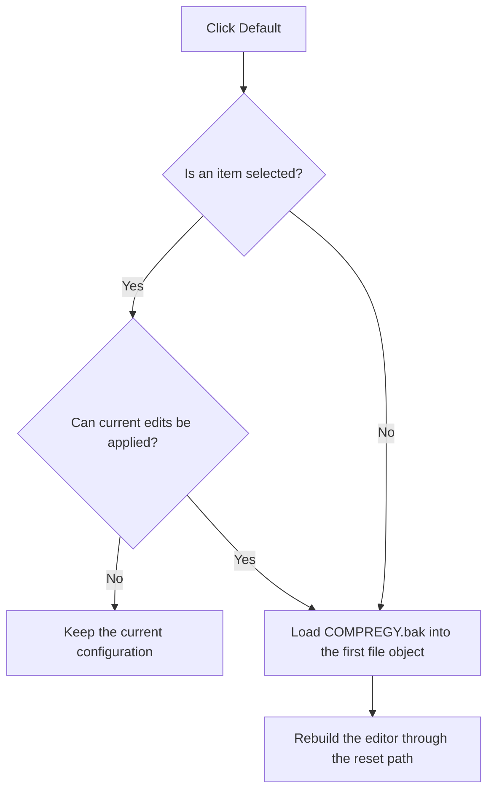

# D&efault

> Analysis status: Reviewed against the recovered handler and reset path.

## Control

| Property | Recovered value |
| --- | --- |
| Form | frmEditCompRack |
| Component path | frmEditCompRack.pnlToolBar.btnDefault |
| Control class | TButton |
| Caption | D&efault |
| Hint | Factory defaults\|Restore the original configuration of the Component Bar |
| Text | Not present in the recovered resource. |
| Handler name | btnDefaultClick |
| Handler address | 01b99360 |
| Graph node | `resource:dfm:frmEditCompRack/frmEditCompRack.pnlToolBar.btnDefault` |
| Handler node | `function:01b99360` |
| Graph layer | UI |

## What happens when clicked

If a tree item is selected, the handler first applies and validates its current editor values. It stops if that operation fails. The handler then gets the first loaded Component Bar file, builds the application help-directory path `COMPREGY.bak`, and loads that backup file into the first file object. It temporarily disables the normal tree-state cleanup, calls the reset handler to rebuild the editor from the loaded backup, and restores cleanup for later resets.

## Click flow

## Handler evidence

- Source: [DecompiledSources/Tina16/functions/0000000001B99360__FUN_01b99360.c](../../../DecompiledSources/Tina16/functions/0000000001B99360__FUN_01b99360.c)
- Recovered role: Loads the factory Component Bar backup and rebuilds the editor.
- Current graph summary: Handles 1 Delphi UI event: frmEditCompRack.pnlToolBar.btnDefault.OnClick.
- Current graph behavior: Validates a selected item, loads `COMPREGY.bak` into the first file object, suppresses normal cleanup for this transition, calls the reset handler, and restores cleanup.
- Current graph evidence: The handler conditionally requires `FUN_01b96a50`, gets index zero from the file-object list at `0x880`, builds a path from the application help directory plus `COMPREGY` and `.bak`, calls the object's load virtual method at `0xd8`, sets flag `0x8a8` to zero, calls `FUN_01b979d0`, and sets the flag back to one.
- Complexity: complex
- Distinct outgoing calls: 5

## Direct calls

- `function:00414480` — Delphi UnicodeString clear and finalization helper
- `function:00416cd0` — FUN_00416cd0
- `function:006e2530` — FUN_006e2530
- `function:01b96a50` — FUN_01b96a50
- `function:01b979d0` — Handles 1 Delphi UI event: frmEditCompRack.pnlToolBar.btnReset.OnClick.

## Resource evidence

- Kind: Not present in the recovered resource.
- Modal result: Not present in the recovered resource.
- Checked state: Not present in the recovered resource.
- List items: Not present in the recovered resource.
- Image reference: Not present in the recovered resource.
- Extracted glyph: None.

## Nearby label candidates

Nearby labels are layout candidates only. They are not proof of behavior.

- No same-parent label candidate is available.

## Analysis limits

- This handler changes the in-memory first file object. The OK handler performs the file-save loop.
