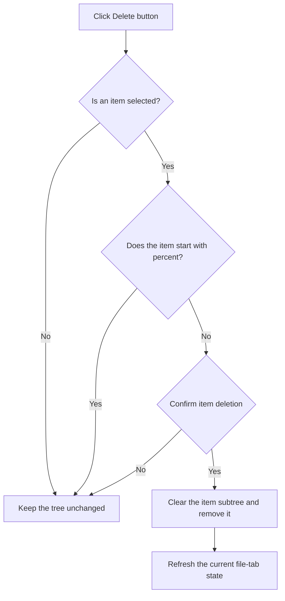

# &Delete

> Analysis status: Reviewed against the recovered handler and call path.

## Control

| Property | Recovered value |
| --- | --- |
| Form | frmEditCompRack |
| Component path | frmEditCompRack.pnlToolBar.btnDelete |
| Control class | TButton |
| Caption | &Delete |
| Hint | Delete\|Deletes the currently selected item (and all its components, if it is a group) |
| Text | Not present in the recovered resource. |
| Handler name | btnDeleteClick |
| Handler address | 01b98570 |
| Graph node | `resource:dfm:frmEditCompRack/frmEditCompRack.pnlToolBar.btnDelete` |
| Handler node | `function:01b98570` |
| Graph layer | UI |

## What happens when clicked

The handler reads the selected Component Bar tree item. It does nothing when there is no selection or when the selected serialized item starts with `%`, which marks an include-file item. For another item, it hides the new-file panel and shows the localized delete-confirmation message. If the user selects **Yes**, it clears the item state recursively for the item and its children, removes the item from the tree model, and refreshes the current file-tab state. If the user selects **No**, it keeps the item.

## Click flow

## Handler evidence

- Source: [DecompiledSources/Tina16/functions/0000000001B98570__FUN_01b98570.c](../../../DecompiledSources/Tina16/functions/0000000001B98570__FUN_01b98570.c)
- Recovered role: Deletes a selected editable Component Bar item after confirmation.
- Current graph summary: Handles 2 Delphi UI events: frmEditCompRack.pnlToolBar.btnDelete.OnClick, frmEditCompRack.pmnuNav.mnDelete.OnClick.
- Current graph behavior: Ignores no selection and `%` include-file items, confirms other deletions, recursively clears item state, removes the selected tree node, and refreshes the current tab.
- Current graph evidence: The handler gets the selected node with `FUN_006e2530`, rejects it when `FUN_01b95150` finds leading character `0x25`, loads string resource `0x83c`, requires dialog result 6, and calls `FUN_01b984f0`. That callee calls recursive `FUN_01b98470`, removes the node from the tree collection, and marks the current tab state.
- Complexity: complex
- Distinct outgoing calls: 8

## Direct calls

- `function:00414480` — Delphi UnicodeString clear and finalization helper
- `function:0064dbe0` — FUN_0064dbe0
- `function:006e2530` — FUN_006e2530
- `function:0072d440` — FUN_0072d440
- `function:00b89270` — FUN_00b89270
- `function:00b8e520` — FUN_00b8e520
- `function:01b95150` — FUN_01b95150
- `function:01b984f0` — FUN_01b984f0

## Resource evidence

- Kind: Not present in the recovered resource.
- Modal result: Not present in the recovered resource.
- Checked state: Not present in the recovered resource.
- List items: Not present in the recovered resource.
- Image reference: Not present in the recovered resource.
- Extracted glyph: None.

## Nearby label candidates

Nearby labels are layout candidates only. They are not proof of behavior.

- No same-parent label candidate is available.

## Analysis limits

- The recovered source does not expose the localized text of resource `0x83c`.
