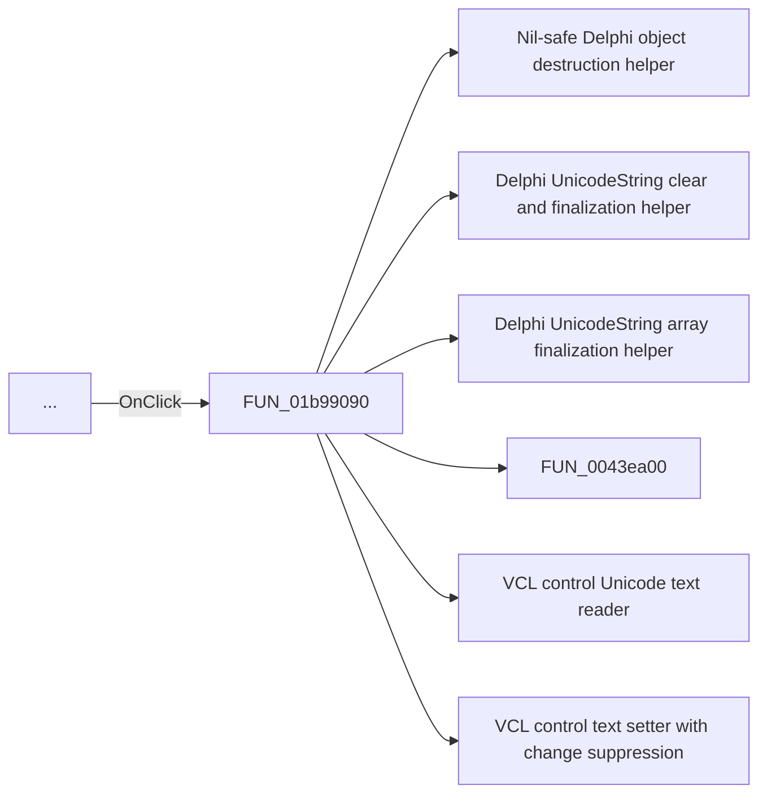

# ...

> Analysis status: Pending individual source review.

## Control

| Property | Recovered value |
| --- | --- |
| Form | frmEditCompRack |
| Component path | frmEditCompRack.pnlControls.pcItemProps.tsFileMacro.btnFileMacroBrowseFile |
| Control class | TButton |
| Caption | ... |
| Hint | Not present in the recovered resource. |
| Text | Not present in the recovered resource. |
| Handler name | btnFileMacroBrowseFileClick |
| Handler address | 01b99090 |
| Graph node | `resource:dfm:frmEditCompRack/frmEditCompRack.pnlControls.pcItemProps.tsFileMacro.btnFileMacroBrowseFile` |
| Handler node | `function:01b99090` |
| Graph layer | UI |

## What happens when clicked

Pending individual analysis. An agent must read the recovered handler source and its relevant callees before it replaces this text.

## Click flow

## Handler evidence

- Source: [DecompiledSources/Tina16/functions/0000000001B99090__FUN_01b99090.c](../../../DecompiledSources/Tina16/functions/0000000001B99090__FUN_01b99090.c)
- Recovered role: Not present in the recovered resource.
- Current graph summary: Handles 1 Delphi UI event: frmEditCompRack.pnlControls.pcItemProps.tsFileMacro.btnFileMacroBrowseFile.OnClick.
- Current graph behavior: Not present in the recovered resource.
- Current graph evidence: Not present in the recovered resource.
- Complexity: complex
- Distinct outgoing calls: 10

## Direct calls

- `function:00410f20` — Nil-safe Delphi object destruction helper
- `function:00414480` — Delphi UnicodeString clear and finalization helper
- `function:00414560` — Delphi UnicodeString array finalization helper
- `function:0043ea00` — FUN_0043ea00
- `function:0064dd90` — VCL control Unicode text reader
- `function:0064de00` — VCL control text setter with change suppression
- `function:006e2530` — FUN_006e2530
- `function:00724270` — FUN_00724270
- `function:017708f0` — FUN_017708f0
- `function:01b96ae0` — FUN_01b96ae0

## Resource evidence

- Kind: Not present in the recovered resource.
- Modal result: Not present in the recovered resource.
- Checked state: Not present in the recovered resource.
- List items: Not present in the recovered resource.
- Image reference: Not present in the recovered resource.
- Extracted glyph: None.

## Nearby label candidates

Nearby labels are layout candidates only. They are not proof of behavior.

- Rank 1: File at distance 281.

## Analysis limits

- Do not infer behavior from the control class, caption, hint, glyph, or nearby label alone.
- Do not replace the pending status until the handler source and relevant call path provide enough evidence.
