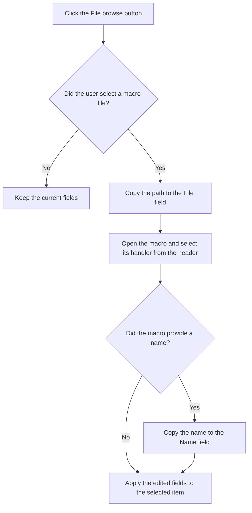

# ...

> Analysis status: Reviewed against the recovered handler and call path.

## Control

| Property | Recovered value |
| --- | --- |
| Form | frmEditCompRack |
| Component path | frmEditCompRack.pnlControls.pcItemProps.tsFileMacro.btnFileMacroBrowseFile |
| Control class | TButton |
| Caption | ... |
| Hint | Not present in the recovered resource. |
| Text | Not present in the recovered resource. |
| Handler name | btnFileMacroBrowseFileClick |
| Handler address | 01b99090 |
| Graph node | `resource:dfm:frmEditCompRack/frmEditCompRack.pnlControls.pcItemProps.tsFileMacro.btnFileMacroBrowseFile` |
| Handler node | `function:01b99090` |
| Graph layer | UI |

## What happens when clicked

The handler opens the application's macro file dialog. If the user cancels it, the handler does nothing. If the user selects a file, the handler copies the dialog file name to the **File** field. It opens the selected macro, identifies the supported macro family from the recovered header text, and asks the corresponding macro handler to read its metadata. When that handler returns a non-empty name, the code copies it to the component **Name** field. It then applies the edited values to the selected Component Bar item and destroys the temporary macro handler.

## Click flow

## Handler evidence

- Source: [DecompiledSources/Tina16/functions/0000000001B99090__FUN_01b99090.c](../../../DecompiledSources/Tina16/functions/0000000001B99090__FUN_01b99090.c)
- Recovered role: Selects a macro file and applies its path and metadata to the current Component Bar item.
- Current graph summary: Handles 1 Delphi UI event: frmEditCompRack.pnlControls.pcItemProps.tsFileMacro.btnFileMacroBrowseFile.OnClick.
- Current graph behavior: On dialog acceptance, copies the selected path, selects a handler for four recovered macro header types, reads macro metadata, copies a returned name when present, and applies the values to the selected item. Cancellation is a no-op.
- Current graph evidence: The handler tests the global dialog's execute result, reads its file name with `FUN_00724270`, writes the file editor, passes that path to `FUN_017708f0`, constructs the returned handler, invokes its load method, copies `local_20[7]` to the name editor when non-empty, calls `FUN_01b96ae0` for the selected tree item, and destroys the temporary object. `FUN_017708f0` recognizes `Schematics Macro`, `Spice Macro`, `VHDL Macro`, and `VerilogAMS Macro` headers.
- Complexity: complex
- Distinct outgoing calls: 10

## Direct calls

- `function:00410f20` — Nil-safe Delphi object destruction helper
- `function:00414480` — Delphi UnicodeString clear and finalization helper
- `function:00414560` — Delphi UnicodeString array finalization helper
- `function:0043ea00` — FUN_0043ea00
- `function:0064dd90` — VCL control Unicode text reader
- `function:0064de00` — VCL control text setter with change suppression
- `function:006e2530` — FUN_006e2530
- `function:00724270` — FUN_00724270
- `function:017708f0` — FUN_017708f0
- `function:01b96ae0` — FUN_01b96ae0

## Resource evidence

- Kind: Not present in the recovered resource.
- Modal result: Not present in the recovered resource.
- Checked state: Not present in the recovered resource.
- List items: Not present in the recovered resource.
- Image reference: Not present in the recovered resource.
- Extracted glyph: None.

## Nearby label candidates

Nearby labels are layout candidates only. They are not proof of behavior.

- Rank 1: File at distance 281.

## Analysis limits

- The recovered code delegates file-format errors to the selected macro handler.
