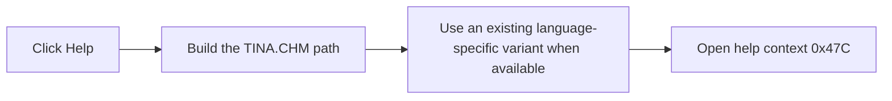

# &Help

> Analysis status: Reviewed against the recovered handler and help-file resolver.

## Control

| Property | Recovered value |
| --- | --- |
| Form | frmEditCompRack |
| Component path | frmEditCompRack.pnlControls.pnlButtons.btnHelp |
| Control class | TButton |
| Caption | &Help |
| Hint | Not present in the recovered resource. |
| Text | Not present in the recovered resource. |
| Handler name | btnHelpClick |
| Handler address | 01b99790 |
| Graph node | `resource:dfm:frmEditCompRack/frmEditCompRack.pnlControls.pnlButtons.btnHelp` |
| Handler node | `function:01b99790` |
| Graph layer | UI |

## What happens when clicked

The handler builds the path to `TINA.CHM` in the application help directory. It then selects an existing language-specific file variant when one is available; otherwise, it keeps the base file path. Finally, it sends Component Bar help context `0x47C` to the application's help service.

## Click flow

## Handler evidence

- Source: [DecompiledSources/Tina16/functions/0000000001B99790__FUN_01b99790.c](../../../DecompiledSources/Tina16/functions/0000000001B99790__FUN_01b99790.c)
- Recovered role: Opens the Component Bar topic in the TINA help file.
- Current graph summary: Handles 1 Delphi UI event: frmEditCompRack.pnlControls.pnlButtons.btnHelp.OnClick.
- Current graph behavior: Resolves `TINA.CHM` through the language-specific help-file helper and dispatches help context `0x47C`.
- Current graph evidence: The handler concatenates the application help directory with recovered literal `TINA.CHM`, calls annotated helper `FUN_01b1def0`, and invokes the global help service with constant `0x47c` and the resolved path. Form creation also assigns help context `0x47c` to this form.
- Complexity: complex
- Distinct outgoing calls: 3

## Direct calls

- `function:00414560` — Delphi UnicodeString array finalization helper
- `function:00416cd0` — FUN_00416cd0
- `function:01b1def0` — FUN_01b1def0

## Resource evidence

- Kind: Not present in the recovered resource.
- Modal result: Not present in the recovered resource.
- Checked state: Not present in the recovered resource.
- List items: Not present in the recovered resource.
- Image reference: Not present in the recovered resource.
- Extracted glyph: None.

## Nearby label candidates

Nearby labels are layout candidates only. They are not proof of behavior.

- No same-parent label candidate is available.

## Analysis limits

- The exact topic title is not present in the recovered handler.
