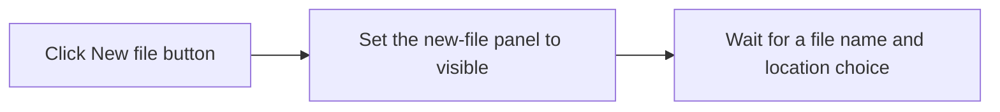

# New file

> Analysis status: Reviewed against the recovered handler and call path.

## Control

| Property | Recovered value |
| --- | --- |
| Form | frmEditCompRack |
| Component path | frmEditCompRack.pnlToolBar.btnNewFile |
| Control class | TButton |
| Caption | New file |
| Hint | New component file\|Creates a new component file |
| Text | Not present in the recovered resource. |
| Handler name | btnNewFileClick |
| Handler address | 01b9a3e0 |
| Graph node | `resource:dfm:frmEditCompRack/frmEditCompRack.pnlToolBar.btnNewFile` |
| Handler node | `function:01b9a3e0` |
| Graph layer | UI |

## What happens when clicked

The handler shows the new-file panel. The panel contains the file-name field, the **Private** and **Shared** location choices, the create button, and the close button. This toolbar button and the **New file** menu item use the same handler and have the same effect.

## Click flow

## Handler evidence

- Source: [DecompiledSources/Tina16/functions/0000000001B9A3E0__FUN_01b9a3e0.c](../../../DecompiledSources/Tina16/functions/0000000001B9A3E0__FUN_01b9a3e0.c)
- Recovered role: Opens the Component Bar new-file panel.
- Current graph summary: Handles 2 Delphi UI events: frmEditCompRack.pnlToolBar.btnNewFile.OnClick, frmEditCompRack.pmnuIniFile.pmnuNewFile.OnClick.
- Current graph behavior: Sets the panel at form offset `0x810` to visible.
- Current graph evidence: The handler calls the recovered VCL visibility setter `FUN_0064dbe0` with the object at `param_1 + 0x810` and value 1. Form creation uses that same object with value 0 to hide it initially.
- Complexity: simple
- Distinct outgoing calls: 1

## Direct calls

- `function:0064dbe0` — FUN_0064dbe0

## Resource evidence

- Kind: Not present in the recovered resource.
- Modal result: Not present in the recovered resource.
- Checked state: Not present in the recovered resource.
- List items: Not present in the recovered resource.
- Image reference: Not present in the recovered resource.
- Extracted glyph: None.

## Nearby label candidates

Nearby labels are layout candidates only. They are not proof of behavior.

- No same-parent label candidate is available.

## Analysis limits

- This click does not create a file. The create button performs that operation.
