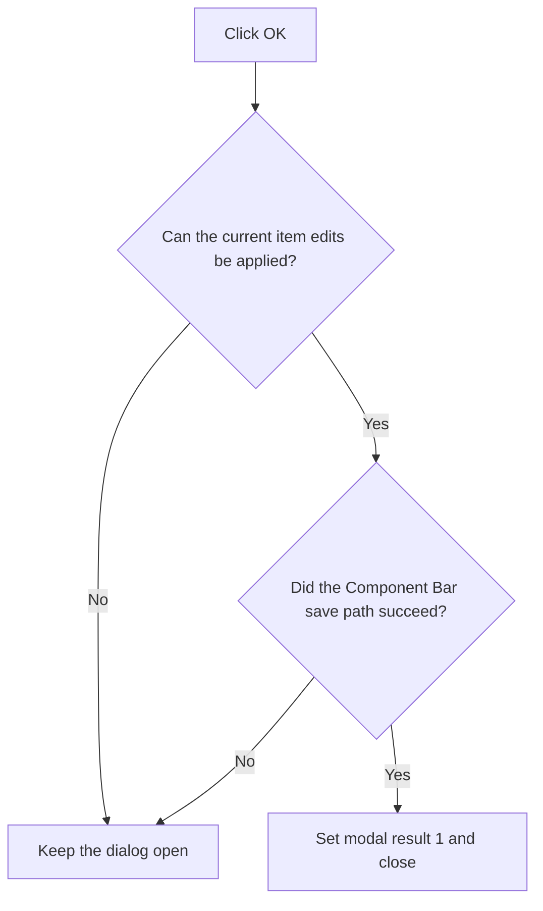

# OK

> Analysis status: Reviewed against the recovered handler and save path.

## Control

| Property | Recovered value |
| --- | --- |
| Form | frmEditCompRack |
| Component path | frmEditCompRack.pnlControls.pnlButtons.btnOK |
| Control class | TButton |
| Caption | OK |
| Hint | Not present in the recovered resource. |
| Text | Not present in the recovered resource. |
| Handler name | btnOKClick |
| Handler address | 01b98120 |
| Graph node | `resource:dfm:frmEditCompRack/frmEditCompRack.pnlControls.pnlButtons.btnOK` |
| Handler node | `function:01b98120` |
| Graph layer | UI |

## What happens when clicked

The handler first applies and validates the current editor values for the selected tree item. If that operation fails, it keeps the dialog open. If it succeeds, the handler saves every loaded Component Bar file and updates the associated application state. It sets the form modal result to 1 only after the save path succeeds, which closes the dialog with the accepted result.

## Click flow

## Handler evidence

- Source: [DecompiledSources/Tina16/functions/0000000001B98120__FUN_01b98120.c](../../../DecompiledSources/Tina16/functions/0000000001B98120__FUN_01b98120.c)
- Recovered role: Validates and saves Component Bar changes before accepting the dialog.
- Current graph summary: Handles 1 Delphi UI event: frmEditCompRack.pnlControls.pnlButtons.btnOK.OnClick.
- Current graph behavior: Applies the current tree-item fields, saves each loaded Component Bar file and its related application state, and sets modal result 1 only after both calls report success.
- Current graph evidence: The handler gets the selected tree item, requires nonzero results from `FUN_01b96a50` and `FUN_01b95e40`, and then writes 1 to the form modal-result field at `0x508`. `FUN_01b95e40` copies the primary object association, writes modified file buffers through their virtual save method, and updates the application list before it returns success.
- Complexity: complex
- Distinct outgoing calls: 3

## Direct calls

- `function:006e2530` — FUN_006e2530
- `function:01b95e40` — FUN_01b95e40
- `function:01b96a50` — FUN_01b96a50

## Resource evidence

- Kind: Not present in the recovered resource.
- Modal result: 1
- Checked state: Not present in the recovered resource.
- List items: Not present in the recovered resource.
- Image reference: Not present in the recovered resource.
- Extracted glyph: None.

## Nearby label candidates

Nearby labels are layout candidates only. They are not proof of behavior.

- No same-parent label candidate is available.

## Analysis limits

- The recovered save helper always returns success after its write loop; delegated write errors are not explicit in this function.
