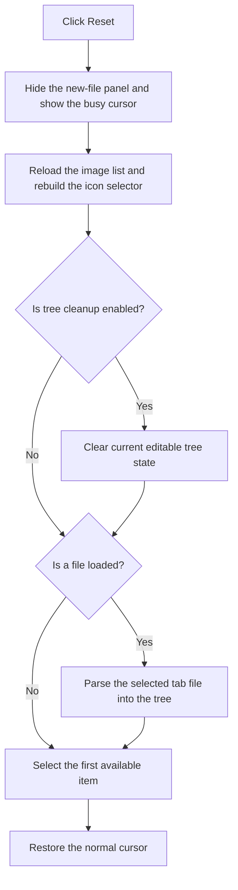

# &Reset

> Analysis status: Reviewed against the recovered handler and reload path.

## Control

| Property | Recovered value |
| --- | --- |
| Form | frmEditCompRack |
| Component path | frmEditCompRack.pnlToolBar.btnReset |
| Control class | TButton |
| Caption | &Reset |
| Hint | Reset\|Discard current changes made to the Component Bar |
| Text | Not present in the recovered resource. |
| Handler name | btnResetClick |
| Handler address | 01b979d0 |
| Graph node | `resource:dfm:frmEditCompRack/frmEditCompRack.pnlToolBar.btnReset` |
| Handler node | `function:01b979d0` |
| Graph layer | UI |

## What happens when clicked

The handler hides the new-file panel and changes the application cursor to its busy state. It reloads the Component Bar image list, clears and repopulates the icon selector with every available image index, and clears the current editable tree state when the reset flag permits that operation. If a Component Bar file is loaded, it parses the file for the selected tab back into the tree. It then selects the first tree item and restores the normal cursor. Thus, current unsaved editor changes are discarded and the selected backing file becomes the UI state again.

## Click flow

## Handler evidence

- Source: [DecompiledSources/Tina16/functions/0000000001B979D0__FUN_01b979d0.c](../../../DecompiledSources/Tina16/functions/0000000001B979D0__FUN_01b979d0.c)
- Recovered role: Reloads Component Bar UI state from the selected backing file.
- Current graph summary: Handles 1 Delphi UI event: frmEditCompRack.pnlToolBar.btnReset.OnClick.
- Current graph behavior: Hides the new-file panel, uses a busy cursor, refreshes the image list and icon selector, conditionally clears the current tree, parses the selected loaded file, selects the first item, and restores the cursor.
- Current graph evidence: The handler calls `FUN_0064dbe0(panel, 0)`, sets cursor value `0xfff5`, resolves the image list through `FUN_00c85d40`, clears and repopulates the icon combo items from its count, calls `FUN_01b951f0` when flag `0x8a8` is set, gets the selected file object from list `0x880`, passes it to parser `FUN_01b95260`, selects item zero with `FUN_01b97960`, and restores cursor value 0.
- Complexity: complex
- Distinct outgoing calls: 9

## Direct calls

- `function:00414480` — Delphi UnicodeString clear and finalization helper
- `function:0043f750` — FUN_0043f750
- `function:0064dbe0` — FUN_0064dbe0
- `function:006d5120` — FUN_006d5120
- `function:008088b0` — FUN_008088b0
- `function:00c85d40` — FUN_00c85d40
- `function:01b951f0` — FUN_01b951f0
- `function:01b95260` — FUN_01b95260
- `function:01b97960` — FUN_01b97960

## Resource evidence

- Kind: Not present in the recovered resource.
- Modal result: Not present in the recovered resource.
- Checked state: Not present in the recovered resource.
- List items: Not present in the recovered resource.
- Image reference: Not present in the recovered resource.
- Extracted glyph: None.

## Nearby label candidates

Nearby labels are layout candidates only. They are not proof of behavior.

- No same-parent label candidate is available.

## Analysis limits

- The parser supports group, component, include-file, and related serialized record forms. Their complete file-format grammar is outside this click article.
