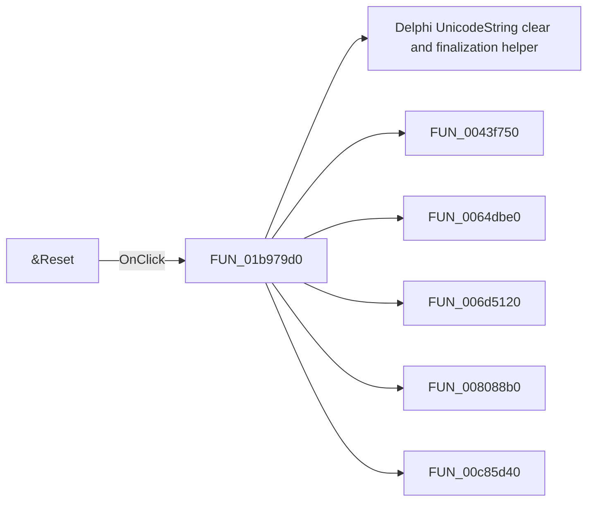

# &Reset

> Analysis status: Pending individual source review.

## Control

| Property | Recovered value |
| --- | --- |
| Form | frmEditCompRack |
| Component path | frmEditCompRack.pnlToolBar.btnReset |
| Control class | TButton |
| Caption | &Reset |
| Hint | Reset\|Discard current changes made to the Component Bar |
| Text | Not present in the recovered resource. |
| Handler name | btnResetClick |
| Handler address | 01b979d0 |
| Graph node | `resource:dfm:frmEditCompRack/frmEditCompRack.pnlToolBar.btnReset` |
| Handler node | `function:01b979d0` |
| Graph layer | UI |

## What happens when clicked

Pending individual analysis. An agent must read the recovered handler source and its relevant callees before it replaces this text.

## Click flow

## Handler evidence

- Source: [DecompiledSources/Tina16/functions/0000000001B979D0__FUN_01b979d0.c](../../../DecompiledSources/Tina16/functions/0000000001B979D0__FUN_01b979d0.c)
- Recovered role: Not present in the recovered resource.
- Current graph summary: Handles 1 Delphi UI event: frmEditCompRack.pnlToolBar.btnReset.OnClick.
- Current graph behavior: Not present in the recovered resource.
- Current graph evidence: Not present in the recovered resource.
- Complexity: complex
- Distinct outgoing calls: 9

## Direct calls

- `function:00414480` — Delphi UnicodeString clear and finalization helper
- `function:0043f750` — FUN_0043f750
- `function:0064dbe0` — FUN_0064dbe0
- `function:006d5120` — FUN_006d5120
- `function:008088b0` — FUN_008088b0
- `function:00c85d40` — FUN_00c85d40
- `function:01b951f0` — FUN_01b951f0
- `function:01b95260` — FUN_01b95260
- `function:01b97960` — FUN_01b97960

## Resource evidence

- Kind: Not present in the recovered resource.
- Modal result: Not present in the recovered resource.
- Checked state: Not present in the recovered resource.
- List items: Not present in the recovered resource.
- Image reference: Not present in the recovered resource.
- Extracted glyph: None.

## Nearby label candidates

Nearby labels are layout candidates only. They are not proof of behavior.

- No same-parent label candidate is available.

## Analysis limits

- Do not infer behavior from the control class, caption, hint, glyph, or nearby label alone.
- Do not replace the pending status until the handler source and relevant call path provide enough evidence.
