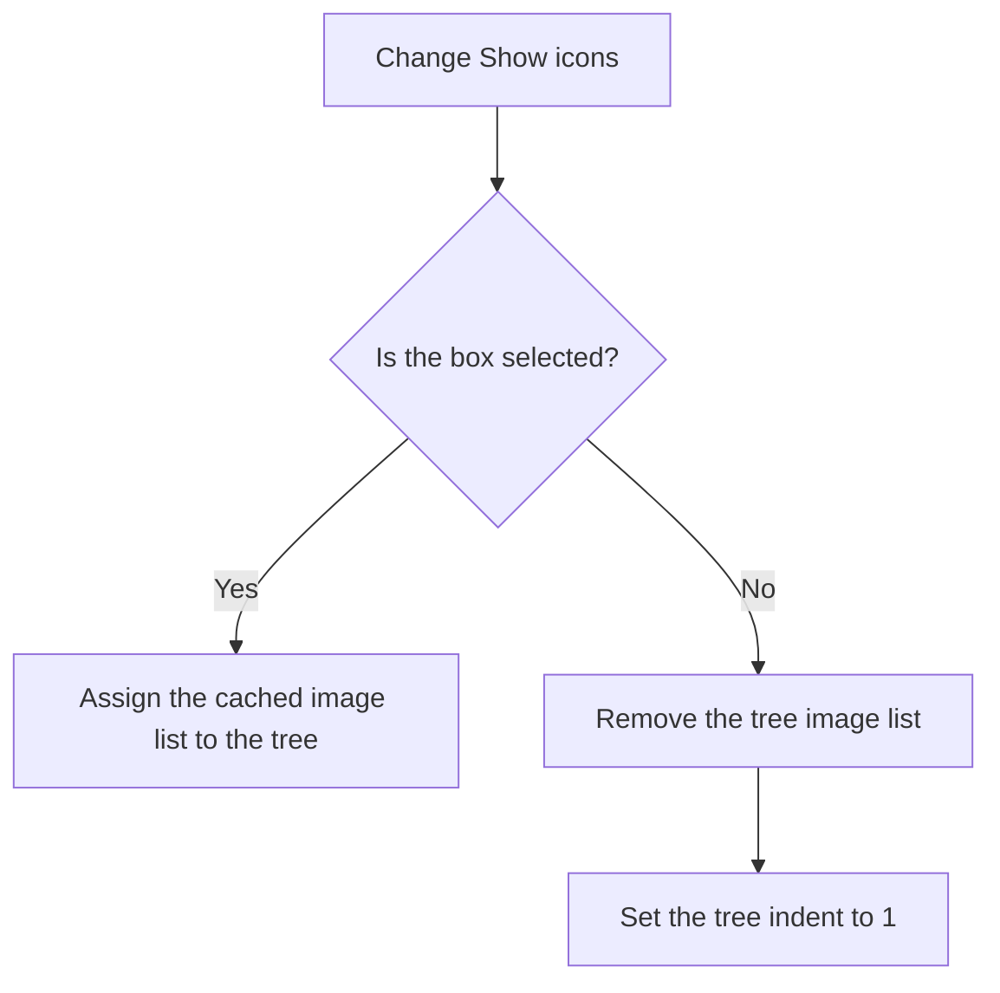

# &Show icons

> Analysis status: Reviewed against the recovered handler and VCL call path.

## Control

| Property | Recovered value |
| --- | --- |
| Form | frmEditCompRack |
| Component path | frmEditCompRack.pnlBrowser.pnlBrowserShowIcons.chkShowBrowserIcons |
| Control class | TCheckBox |
| Caption | &Show icons |
| Hint | Not present in the recovered resource. |
| Text | Not present in the recovered resource. |
| Handler name | chkShowBrowserIconsClick |
| Handler address | 01b99300 |
| Graph node | `resource:dfm:frmEditCompRack/frmEditCompRack.pnlBrowser.pnlBrowserShowIcons.chkShowBrowserIcons` |
| Handler node | `function:01b99300` |
| Graph layer | UI |

## What happens when clicked

The handler reads the check-box state. When the box is clear, it removes the form's image list from the Component Bar tree and sets the tree indent to 1. When the box is selected, it assigns the form's cached image list to the tree. The recovered resource selects the box by default, and form creation calls this handler to apply that initial state.

## Click flow

## Handler evidence

- Source: [DecompiledSources/Tina16/functions/0000000001B99300__FUN_01b99300.c](../../../DecompiledSources/Tina16/functions/0000000001B99300__FUN_01b99300.c)
- Recovered role: Shows or hides icons in the Component Bar tree.
- Current graph summary: Handles 1 Delphi UI event: frmEditCompRack.pnlBrowser.pnlBrowserShowIcons.chkShowBrowserIcons.OnClick.
- Current graph behavior: Assigns the cached image list when checked. When unchecked, it assigns no image list and sets indent 1.
- Current graph evidence: The handler reads the check-box state by virtual call on the field at `0x7f0`. Its clear branch calls `FUN_006e4390(tree, 0)` and `FUN_006e2350(tree, 1)`. Its selected branch calls `FUN_006e4390(tree, imageListAt0x8a0)`. `FUN_006e4390` manages the tree image-list change link, and `FUN_006e2350` sends tree-view message `0x1107`, the indent setter.
- Complexity: moderate
- Distinct outgoing calls: 2

## Direct calls

- `function:006e2350` — FUN_006e2350
- `function:006e4390` — FUN_006e4390

## Resource evidence

- Kind: Not present in the recovered resource.
- Modal result: Not present in the recovered resource.
- Checked state: true
- List items: Not present in the recovered resource.
- Image reference: Not present in the recovered resource.
- Extracted glyph: None.

## Nearby label candidates

Nearby labels are layout candidates only. They are not proof of behavior.

- Rank 1: &Navigator at distance 155.

## Analysis limits

- The handler does not change the stored component data.
