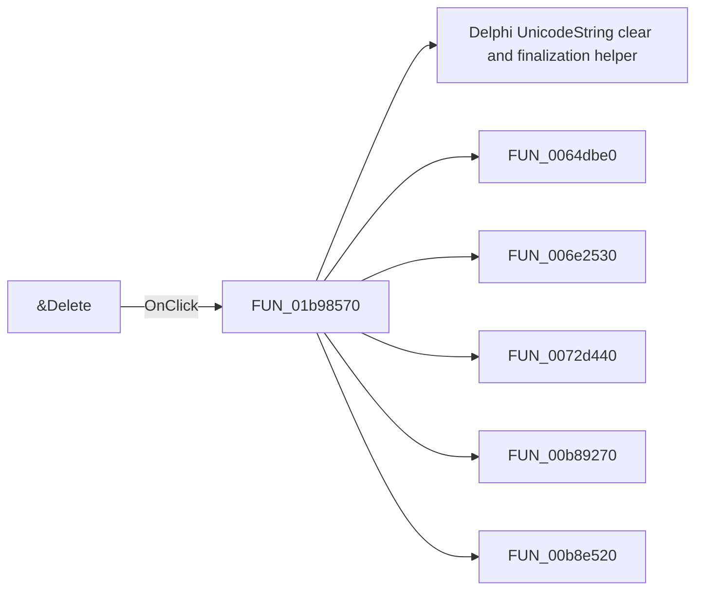

# &Delete

> Analysis status: Pending individual source review.

## Control

| Property | Recovered value |
| --- | --- |
| Form | frmEditCompRack |
| Component path | frmEditCompRack.pmnuNav.mnDelete |
| Control class | TMenuItem |
| Caption | &Delete |
| Hint | Delete the selected component |
| Text | Not present in the recovered resource. |
| Handler name | btnDeleteClick |
| Handler address | 01b98570 |
| Graph node | `resource:dfm:frmEditCompRack/frmEditCompRack.pmnuNav.mnDelete` |
| Handler node | `function:01b98570` |
| Graph layer | UI |

## What happens when clicked

Pending individual analysis. An agent must read the recovered handler source and its relevant callees before it replaces this text.

## Click flow

## Handler evidence

- Source: [DecompiledSources/Tina16/functions/0000000001B98570__FUN_01b98570.c](../../../DecompiledSources/Tina16/functions/0000000001B98570__FUN_01b98570.c)
- Recovered role: Not present in the recovered resource.
- Current graph summary: Handles 2 Delphi UI events: frmEditCompRack.pnlToolBar.btnDelete.OnClick, frmEditCompRack.pmnuNav.mnDelete.OnClick.
- Current graph behavior: Not present in the recovered resource.
- Current graph evidence: Not present in the recovered resource.
- Complexity: complex
- Distinct outgoing calls: 8

## Direct calls

- `function:00414480` — Delphi UnicodeString clear and finalization helper
- `function:0064dbe0` — FUN_0064dbe0
- `function:006e2530` — FUN_006e2530
- `function:0072d440` — FUN_0072d440
- `function:00b89270` — FUN_00b89270
- `function:00b8e520` — FUN_00b8e520
- `function:01b95150` — FUN_01b95150
- `function:01b984f0` — FUN_01b984f0

## Resource evidence

- Kind: Not present in the recovered resource.
- Modal result: Not present in the recovered resource.
- Checked state: Not present in the recovered resource.
- List items: Not present in the recovered resource.
- Image reference: Not present in the recovered resource.
- Extracted glyph: None.

## Nearby label candidates

Nearby labels are layout candidates only. They are not proof of behavior.

- No same-parent label candidate is available.

## Analysis limits

- Do not infer behavior from the control class, caption, hint, glyph, or nearby label alone.
- Do not replace the pending status until the handler source and relevant call path provide enough evidence.
