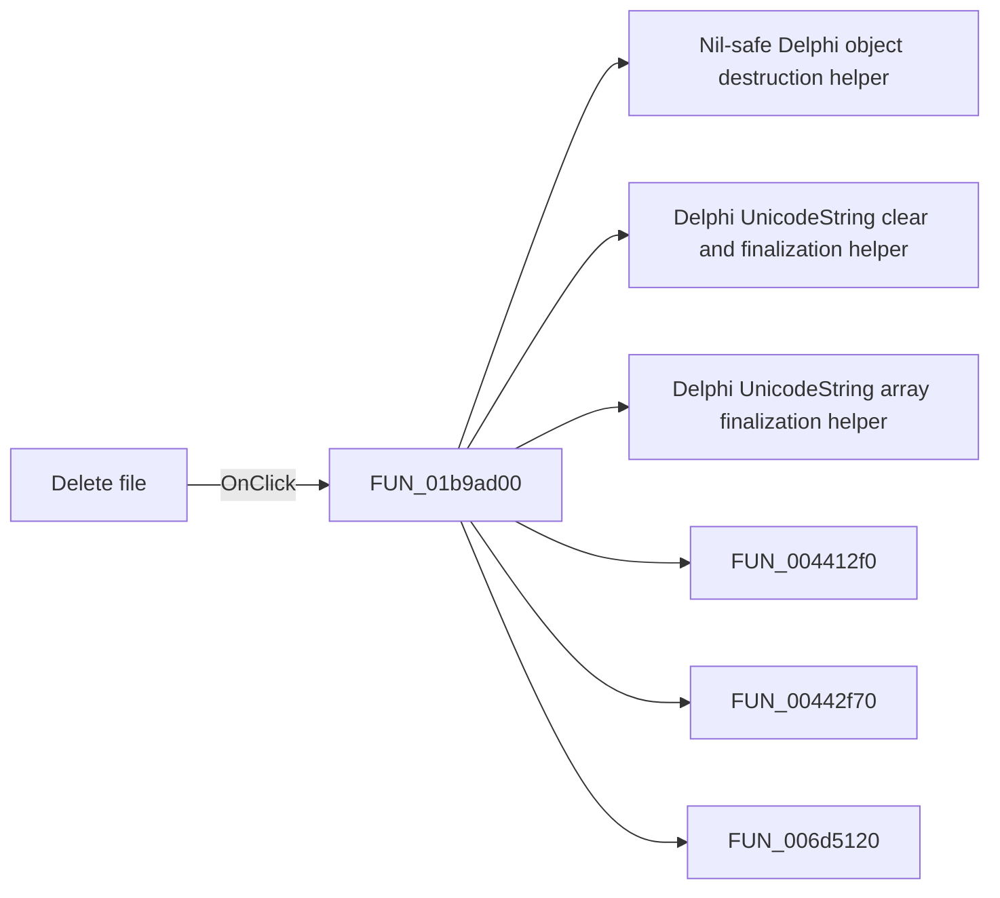

# Delete file

> Analysis status: Pending individual source review.

## Control

| Property | Recovered value |
| --- | --- |
| Form | frmEditCompRack |
| Component path | frmEditCompRack.pmnuIniFile.pmnuDeleteFile |
| Control class | TMenuItem |
| Caption | Delete file |
| Hint | Not present in the recovered resource. |
| Text | Not present in the recovered resource. |
| Handler name | pmnuDeleteFileClick |
| Handler address | 01b9ad00 |
| Graph node | `resource:dfm:frmEditCompRack/frmEditCompRack.pmnuIniFile.pmnuDeleteFile` |
| Handler node | `function:01b9ad00` |
| Graph layer | UI |

## What happens when clicked

Pending individual analysis. An agent must read the recovered handler source and its relevant callees before it replaces this text.

## Click flow

## Handler evidence

- Source: [DecompiledSources/Tina16/functions/0000000001B9AD00__FUN_01b9ad00.c](../../../DecompiledSources/Tina16/functions/0000000001B9AD00__FUN_01b9ad00.c)
- Recovered role: Not present in the recovered resource.
- Current graph summary: Handles 1 Delphi UI event: frmEditCompRack.pmnuIniFile.pmnuDeleteFile.OnClick.
- Current graph behavior: Not present in the recovered resource.
- Current graph evidence: Not present in the recovered resource.
- Complexity: complex
- Distinct outgoing calls: 9

## Direct calls

- `function:00410f20` — Nil-safe Delphi object destruction helper
- `function:00414480` — Delphi UnicodeString clear and finalization helper
- `function:00414560` — Delphi UnicodeString array finalization helper
- `function:004412f0` — FUN_004412f0
- `function:00442f70` — FUN_00442f70
- `function:006d5120` — FUN_006d5120
- `function:006d6380` — FUN_006d6380
- `function:0072d440` — FUN_0072d440
- `function:01b979d0` — Handles 1 Delphi UI event: frmEditCompRack.pnlToolBar.btnReset.OnClick.

## Resource evidence

- Kind: Not present in the recovered resource.
- Modal result: Not present in the recovered resource.
- Checked state: Not present in the recovered resource.
- List items: Not present in the recovered resource.
- Image reference: Not present in the recovered resource.
- Extracted glyph: None.

## Nearby label candidates

Nearby labels are layout candidates only. They are not proof of behavior.

- No same-parent label candidate is available.

## Analysis limits

- Do not infer behavior from the control class, caption, hint, glyph, or nearby label alone.
- Do not replace the pending status until the handler source and relevant call path provide enough evidence.
