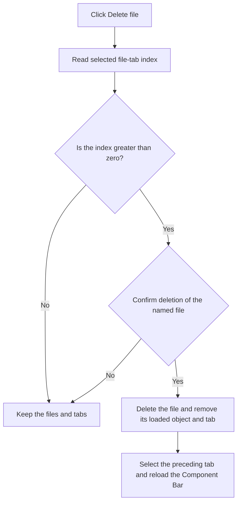

# Delete file

> Analysis status: Reviewed against the recovered handler and call path.

## Control

| Property | Recovered value |
| --- | --- |
| Form | frmEditCompRack |
| Component path | frmEditCompRack.pmnuIniFile.pmnuDeleteFile |
| Control class | TMenuItem |
| Caption | Delete file |
| Hint | Not present in the recovered resource. |
| Text | Not present in the recovered resource. |
| Handler name | pmnuDeleteFileClick |
| Handler address | 01b9ad00 |
| Graph node | `resource:dfm:frmEditCompRack/frmEditCompRack.pmnuIniFile.pmnuDeleteFile` |
| Handler node | `function:01b9ad00` |
| Graph layer | UI |

## What happens when clicked

The handler reads the selected component-file tab. It does nothing when the first tab is selected or when no later tab is selected. For a later tab, it shows a confirmation message that includes the file name. If the user selects **No**, it keeps the file and the current UI state. If the user selects **Yes**, it deletes the file from disk, destroys and removes its loaded file object, removes its tab, selects the preceding tab, and reloads the Component Bar from that selection.

## Click flow

## Handler evidence

- Source: [DecompiledSources/Tina16/functions/0000000001B9AD00__FUN_01b9ad00.c](../../../DecompiledSources/Tina16/functions/0000000001B9AD00__FUN_01b9ad00.c)
- Recovered role: Deletes a selected non-primary Component Bar file after confirmation.
- Current graph summary: Handles 1 Delphi UI event: frmEditCompRack.pmnuIniFile.pmnuDeleteFile.OnClick.
- Current graph behavior: Rejects tab index zero, confirms a later file by name, deletes it from disk and the two UI collections, selects the preceding tab, and calls the reset handler.
- Current graph evidence: The recovered handler checks the selected tab index for a value greater than zero, formats `%s will be deleted. Continue?`, requires message result 6, calls `FUN_004412f0` with the stored path, removes the matching loaded object and tab, selects index minus one, and calls `FUN_01b979d0`.
- Complexity: complex
- Distinct outgoing calls: 9

## Direct calls

- `function:00410f20` — Nil-safe Delphi object destruction helper
- `function:00414480` — Delphi UnicodeString clear and finalization helper
- `function:00414560` — Delphi UnicodeString array finalization helper
- `function:004412f0` — FUN_004412f0
- `function:00442f70` — FUN_00442f70
- `function:006d5120` — FUN_006d5120
- `function:006d6380` — FUN_006d6380
- `function:0072d440` — FUN_0072d440
- `function:01b979d0` — Handles 1 Delphi UI event: frmEditCompRack.pnlToolBar.btnReset.OnClick.

## Resource evidence

- Kind: Not present in the recovered resource.
- Modal result: Not present in the recovered resource.
- Checked state: Not present in the recovered resource.
- List items: Not present in the recovered resource.
- Image reference: Not present in the recovered resource.
- Extracted glyph: None.

## Nearby label candidates

Nearby labels are layout candidates only. They are not proof of behavior.

- No same-parent label candidate is available.

## Analysis limits

- The recovered source does not expose the operating-system error that can occur if file deletion fails.
