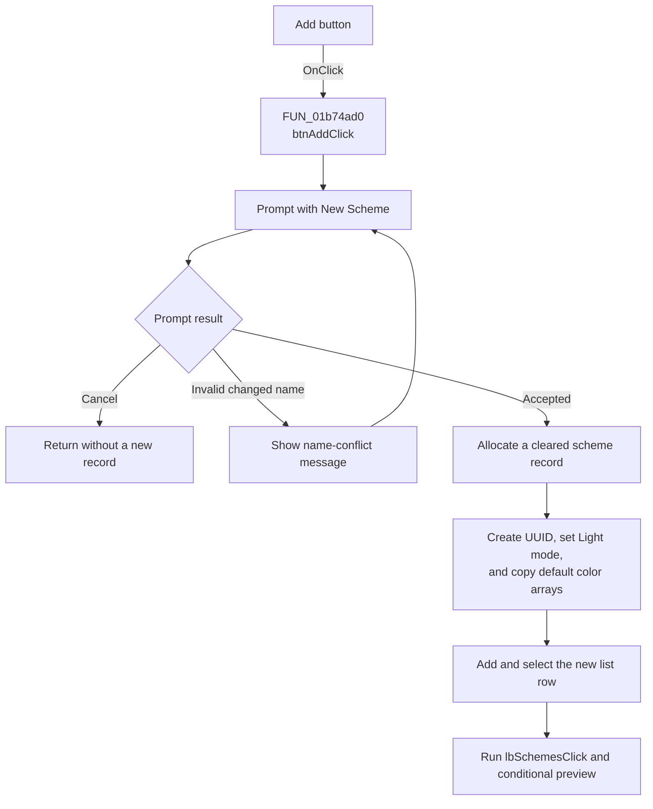

# &Add...

> Analysis status: Recovered new-scheme creation path reviewed.

## Control

| Property | Recovered value |
| --- | --- |
| Form | frmEditorSchemes |
| Component path | frmEditorSchemes.pnlSchemes.btnAdd |
| Control class | TButton |
| Caption | &Add... |
| Hint | Not present in the recovered resource. |
| Text | Not present in the recovered resource. |
| Handler name | btnAddClick |
| Handler address | 01b74ad0 |
| Graph node | `resource:dfm:frmEditorSchemes/frmEditorSchemes.pnlSchemes.btnAdd` |
| Handler node | `function:01b74ad0` |
| Graph layer | UI |

## What happens when clicked

`btnAddClick` proposes `New Scheme` and opens the shared scheme-name prompt. If
the user changes the proposed text, the prompt requires a nonempty name that is
not already in `lbSchemes`. Invalid or conflicting text shows `The name is not
valid or conflicts with another name.` and opens the prompt again. Cancel
returns without creating a record.

After acceptance, the handler allocates and clears a `0x1F0`-byte scheme
record. It creates a UUID, formats it as braced text, sets mode `0` (Light), and
copies the recovered default 27-color palette and 16-pair mapping into the
record. It adds the entered display name and record to the scheme list, selects
the new row, and calls the list-selection handler. The normal default-selected
preview option can then display the new scheme.

The new scheme exists only in the dialog until OK rewrites the INI section.

## Click flow

## Handler evidence

- Source: [FUN_01b74ad0](../../../DecompiledSources/Tina16/functions/0000000001B74AD0__FUN_01b74ad0.c)
- Name prompt and validation: [FUN_01b74860](../../../DecompiledSources/Tina16/functions/0000000001B74860__FUN_01b74860.c)
- List-selection path: [FUN_01b74210](../../../DecompiledSources/Tina16/functions/0000000001B74210__FUN_01b74210.c)
- UUID creation: [FUN_0043dc90](../../../DecompiledSources/Tina16/functions/000000000043DC90__FUN_0043dc90.c)
- UUID formatting: [FUN_0043dec0](../../../DecompiledSources/Tina16/functions/000000000043DEC0__FUN_0043dec0.c)
- Recovered role: Creates a Light scheme from the recovered default color arrays
  after name prompting.
- Current graph summary: Handles 1 Delphi UI event: frmEditorSchemes.pnlSchemes.btnAdd.OnClick.
- Current graph behavior: Prompts for a name, initializes a new identified
  scheme record, adds it to the list, and selects it.
- Current graph evidence: `FUN_01b74ad0` initializes the prompt with
  `New Scheme`, calls `01B74860`, allocates and clears `0x1F0` bytes, formats a
  new UUID into record offset `0`, copies default arrays to `+0x104` and
  `+0x170`, adds the record to `lbSchemes`, selects its returned index, and
  calls `01B74210`.
- Complexity: complex
- Distinct outgoing calls: 10

## Direct calls

- `function:004095c0` and `function:0040d200` - allocate and clear the record.
- `function:00416910` - stores the formatted UUID as a fixed short string.
- `function:0043dc90` and `function:0043dec0` - create and format the UUID.
- `function:0074b490` - sets the Light radio-group index.
- `function:01b74210` - resolves the new current record and runs preview.
- `function:01b74860` - prompts for and checks the scheme display name.

## Resource evidence

- Caption: &Add...
- Kind: Not present in the recovered resource.
- Modal result: Not present in the recovered resource.
- Checked state: Not present in the recovered resource.
- List items: Not present in the recovered resource.
- Image reference: Not present in the recovered resource.
- Extracted glyph: None.

## Nearby label candidates

- Rank 1: Sc&hemes at distance 280. The list insert and selection calls, not
  distance alone, confirm that this button adds to `lbSchemes`.

## Analysis limits

- The name helper accepts the unchanged proposed text before it checks the list
  for a conflict. Therefore, accepting `New Scheme` unchanged does not run the
  duplicate-name lookup in this path.
- The handler ignores the UUID creator's returned status. It has no local UUID
  failure message or retry.
- The original constant names for the default arrays are not recovered. Their
  sizes and later scheme serialization establish their palette roles.
