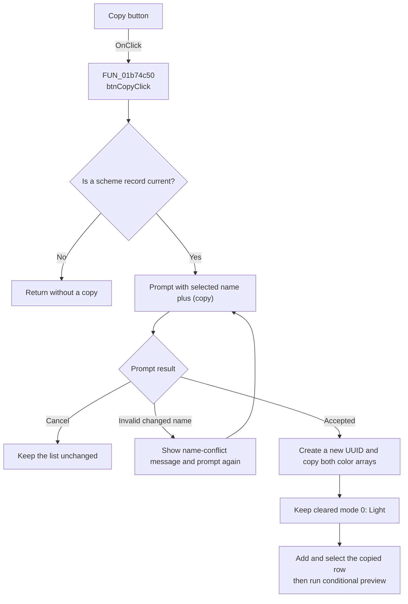

# &Copy...

> Analysis status: Recovered scheme-copy path reviewed.

## Control

| Property | Recovered value |
| --- | --- |
| Form | frmEditorSchemes |
| Component path | frmEditorSchemes.pnlSchemes.btnCopy |
| Control class | TButton |
| Caption | &Copy... |
| Hint | Not present in the recovered resource. |
| Text | Not present in the recovered resource. |
| Handler name | btnCopyClick |
| Handler address | 01b74c50 |
| Graph node | `resource:dfm:frmEditorSchemes/frmEditorSchemes.pnlSchemes.btnCopy` |
| Handler node | `function:01b74c50` |
| Graph layer | UI |

## What happens when clicked

`btnCopyClick` requires a current scheme record. With no current record, it
returns without opening the name prompt.

The handler reads the selected list-row name, adds ` (copy)`, and passes that
proposal to the shared name prompt. A changed name must be nonempty and absent
from the current list. Invalid text shows a conflict message and prompts again.
Cancel keeps the list unchanged.

After acceptance, the handler allocates and clears a new `0x1F0`-byte record,
creates a different UUID, and copies the source record's 27 main colors and 16
color-mapping pairs. It does not copy the source mode byte. The cleared mode
byte is `0`, so the new scheme is Light. It adds and selects the new row and
calls the list-selection handler, which can apply the normal preview.

The copy remains in memory until OK rewrites the INI section.

## Click flow

## Handler evidence

- Source: [FUN_01b74c50](../../../DecompiledSources/Tina16/functions/0000000001B74C50__FUN_01b74c50.c)
- Name prompt and validation: [FUN_01b74860](../../../DecompiledSources/Tina16/functions/0000000001B74860__FUN_01b74860.c)
- List-selection path: [FUN_01b74210](../../../DecompiledSources/Tina16/functions/0000000001B74210__FUN_01b74210.c)
- UUID creation: [FUN_0043dc90](../../../DecompiledSources/Tina16/functions/000000000043DC90__FUN_0043dc90.c)
- UUID formatting: [FUN_0043dec0](../../../DecompiledSources/Tina16/functions/000000000043DEC0__FUN_0043dec0.c)
- Recovered role: Copies the current scheme colors to a new Light scheme with a
  new identifier and prompted display name.
- Current graph summary: Handles 1 Delphi UI event: frmEditorSchemes.pnlSchemes.btnCopy.OnClick.
- Current graph behavior: Prompts for the copy name, duplicates the color
  arrays into a new record, and selects the new list row.
- Current graph evidence: `FUN_01b74c50` requires record `+0x748`, reads the
  selected row name from `lbSchemes` at `+0x6F8`, appends ` (copy)`, calls
  `01B74860`, clears a new record, writes a new UUID at offset `0`, copies 27
  values from source `+0x104` and 32 values from source `+0x170`, adds the
  record, selects it, and calls `01B74210`. It never copies source byte `+0x100`.
- Complexity: complex
- Distinct outgoing calls: 11

## Direct calls

- `function:004095c0` and `function:0040d200` - allocate and clear the record.
- `function:00416ba0` - appends ` (copy)` to the selected name.
- `function:0043dc90` and `function:0043dec0` - create and format the UUID.
- `function:0074b490` - changes the radio-group selection.
- `function:01b74210` - resolves the copied record and runs preview.
- `function:01b74860` - prompts for and checks the display name.

## Resource evidence

- Caption: &Copy...
- Kind: Not present in the recovered resource.
- Modal result: Not present in the recovered resource.
- Checked state: Not present in the recovered resource.
- List items: Not present in the recovered resource.
- Image reference: Not present in the recovered resource.
- Extracted glyph: None.

## Nearby label candidates

- Rank 1: Sc&hemes at distance 366. The list reads and insert, not distance
  alone, confirm that this button copies an `lbSchemes` record.

## Analysis limits

- The handler briefly sets the radio group from the source mode before it
  selects the new row. `lbSchemesClick` then loads the cleared new record's mode
  byte, so the final copied mode is `0` (Light).
- Accepting the unchanged proposed name bypasses the helper's duplicate lookup.
- The handler ignores the UUID creator's returned status.
