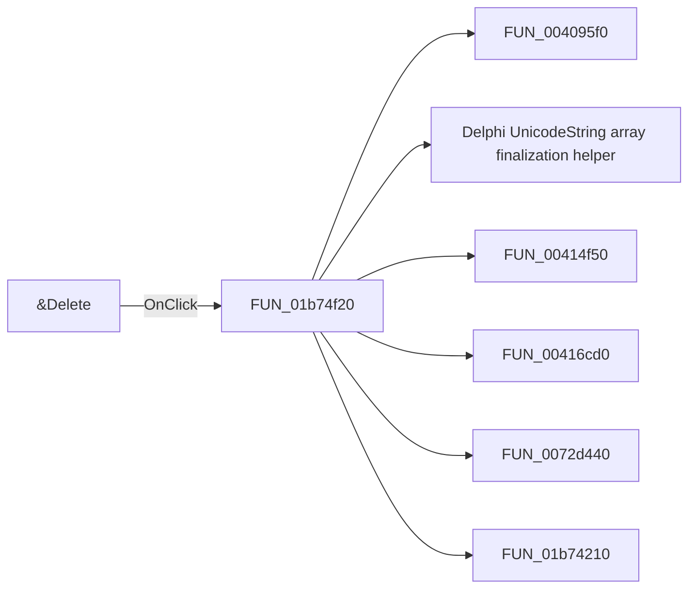

# &Delete

> Analysis status: Pending individual source review.

## Control

| Property | Recovered value |
| --- | --- |
| Form | frmEditorSchemes |
| Component path | frmEditorSchemes.pnlSchemes.btnDelete |
| Control class | TButton |
| Caption | &Delete |
| Hint | Not present in the recovered resource. |
| Text | Not present in the recovered resource. |
| Handler name | btnDeleteClick |
| Handler address | 01b74f20 |
| Graph node | `resource:dfm:frmEditorSchemes/frmEditorSchemes.pnlSchemes.btnDelete` |
| Handler node | `function:01b74f20` |
| Graph layer | UI |

## What happens when clicked

Pending individual analysis. An agent must read the recovered handler source and its relevant callees before it replaces this text.

## Click flow

## Handler evidence

- Source: [DecompiledSources/Tina16/functions/0000000001B74F20__FUN_01b74f20.c](../../../DecompiledSources/Tina16/functions/0000000001B74F20__FUN_01b74f20.c)
- Recovered role: Not present in the recovered resource.
- Current graph summary: Handles 1 Delphi UI event: frmEditorSchemes.pnlSchemes.btnDelete.OnClick.
- Current graph behavior: Not present in the recovered resource.
- Current graph evidence: Not present in the recovered resource.
- Complexity: complex
- Distinct outgoing calls: 6

## Direct calls

- `function:004095f0` — FUN_004095f0
- `function:00414560` — Delphi UnicodeString array finalization helper
- `function:00414f50` — FUN_00414f50
- `function:00416cd0` — FUN_00416cd0
- `function:0072d440` — FUN_0072d440
- `function:01b74210` — Handles 1 Delphi UI event: frmEditorSchemes.pnlSchemes.lbSchemes.OnClick.

## Resource evidence

- Kind: Not present in the recovered resource.
- Modal result: Not present in the recovered resource.
- Checked state: Not present in the recovered resource.
- List items: Not present in the recovered resource.
- Image reference: Not present in the recovered resource.
- Extracted glyph: None.

## Nearby label candidates

Nearby labels are layout candidates only. They are not proof of behavior.

- Rank 1:  Sc&hemes at distance 394.

## Analysis limits

- Do not infer behavior from the control class, caption, hint, glyph, or nearby label alone.
- Do not replace the pending status until the handler source and relevant call path provide enough evidence.
