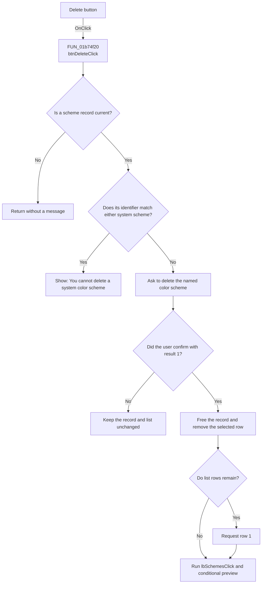

# &Delete

> Analysis status: Recovered protected-scheme deletion path reviewed.

## Control

| Property | Recovered value |
| --- | --- |
| Form | frmEditorSchemes |
| Component path | frmEditorSchemes.pnlSchemes.btnDelete |
| Control class | TButton |
| Caption | &Delete |
| Hint | Not present in the recovered resource. |
| Text | Not present in the recovered resource. |
| Handler name | btnDeleteClick |
| Handler address | 01b74f20 |
| Graph node | `resource:dfm:frmEditorSchemes/frmEditorSchemes.pnlSchemes.btnDelete` |
| Handler node | `function:01b74f20` |
| Graph layer | UI |

## What happens when clicked

`btnDeleteClick` requires a current scheme record. If no record is current, it
returns without a message.

The handler compares the record's fixed identifier with two recovered system
identifiers. A match shows `You cannot delete a system color scheme` and keeps
the record. For another identifier, it reads the selected display name and asks
`Do you want to delete the "<name>" color scheme?`.

Only confirmation result `1` frees the current record, clears the current
record pointer, and removes the selected list row. If rows remain, the handler
requests list index `1`. It then calls the list-selection handler to resolve the
new current record, update the mode control and color grid, and run the
conditional preview. Rejecting the question keeps the record unchanged.

The deletion changes only the dialog list until OK rewrites the INI section.

## Click flow

## Handler evidence

- Source: [FUN_01b74f20](../../../DecompiledSources/Tina16/functions/0000000001B74F20__FUN_01b74f20.c)
- List-selection path: [FUN_01b74210](../../../DecompiledSources/Tina16/functions/0000000001B74210__FUN_01b74210.c)
- VCL message dialog: [FUN_0072d440](../../../DecompiledSources/Tina16/functions/000000000072D440__FUN_0072d440.c)
- Recovered role: Protects two system schemes and conditionally removes another
  current scheme after confirmation.
- Current graph summary: Handles 1 Delphi UI event: frmEditorSchemes.pnlSchemes.btnDelete.OnClick.
- Current graph behavior: Rejects protected identifiers, asks before another
  deletion, and refreshes selection only after confirmed removal.
- Current graph evidence: `FUN_01b74f20` requires record `+0x748`, compares its
  leading fixed string with two constants, builds the confirmation from the
  selected `lbSchemes` text, tests `0072D440` for result `1`, frees the record,
  removes the selected item, requests ItemIndex `1` when count is positive,
  and calls `01B74210`.
- Complexity: complex
- Distinct outgoing calls: 6

## Direct calls

- `function:004095f0` - frees the selected raw scheme record.
- `function:00414f50` - compares the record identifier with protected values.
- `function:00416cd0` - builds the named confirmation text.
- `function:0072d440` - shows the protected message or confirmation dialog.
- `function:01b74210` - resolves the next current record and runs preview.

## Resource evidence

- Caption: &Delete
- Kind: Not present in the recovered resource.
- Modal result: Not present in the recovered resource.
- Checked state: Not present in the recovered resource.
- List items: Not present in the recovered resource.
- Image reference: Not present in the recovered resource.
- Extracted glyph: None.

## Nearby label candidates

- Rank 1: Sc&hemes at distance 394. The selected item read and delete call, not
  distance alone, confirm that this button deletes an `lbSchemes` record.

## Analysis limits

- The original Delphi constant names for the two protected identifiers are not
  recovered. Form loading and legacy migration identify them as the two system
  schemes.
- The handler requests row index `1` after deletion when any row remains. It
  does not calculate the nearest row in this function.
- Canceling the complete scheme dialog also discards this in-memory deletion.
