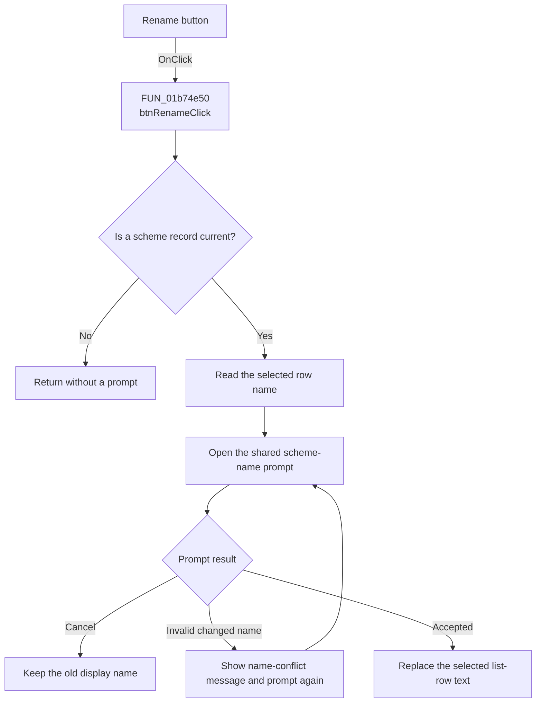

# &Rename...

> Analysis status: Recovered scheme rename path reviewed.

## Control

| Property | Recovered value |
| --- | --- |
| Form | frmEditorSchemes |
| Component path | frmEditorSchemes.pnlSchemes.btnRename |
| Control class | TButton |
| Caption | &Rename... |
| Hint | Not present in the recovered resource. |
| Text | Not present in the recovered resource. |
| Handler name | btnRenameClick |
| Handler address | 01b74e50 |
| Graph node | `resource:dfm:frmEditorSchemes/frmEditorSchemes.pnlSchemes.btnRename` |
| Handler node | `function:01b74e50` |
| Graph layer | UI |

## What happens when clicked

`btnRenameClick` requires a current scheme record. It reads the selected row's
display name and opens the shared scheme-name prompt with that text.

The unchanged name is accepted. A changed name must be nonempty and must not
match another list row. Invalid or conflicting text shows `The name is not
valid or conflicts with another name.` and opens the prompt again. Cancel keeps
the old name.

After acceptance, the handler replaces only the selected list-row text. It
does not change the scheme identifier, mode, palette, mapping, selection, or
live preview. The renamed display value is written to `TINA.INI` only if the
user later selects OK.

## Click flow

## Handler evidence

- Source: [FUN_01b74e50](../../../DecompiledSources/Tina16/functions/0000000001B74E50__FUN_01b74e50.c)
- Name prompt and validation: [FUN_01b74860](../../../DecompiledSources/Tina16/functions/0000000001B74860__FUN_01b74860.c)
- Scheme persistence: [FUN_01b746d0](../../../DecompiledSources/Tina16/functions/0000000001B746D0__FUN_01b746d0.c)
- Recovered role: Renames the selected scheme list entry after shared name
  prompting and conflict checks.
- Current graph summary: Handles 1 Delphi UI event: frmEditorSchemes.pnlSchemes.btnRename.OnClick.
- Current graph behavior: Prompts from the current display name and replaces
  the list text only after acceptance.
- Current graph evidence: `FUN_01b74e50` requires record `+0x748`, reads the
  selected row index and text from `lbSchemes` at `+0x6F8`, calls `01B74860`,
  and only on a true result calls the item-text setter at collection VMT slot
  `+0x40` for the selected index.
- Complexity: moderate
- Distinct outgoing calls: 2

## Direct calls

- `function:00414480` - finalizes the temporary Delphi UnicodeString.
- `function:01b74860` - prompts for and checks the scheme display name.

## Resource evidence

- Caption: &Rename...
- Kind: Not present in the recovered resource.
- Modal result: Not present in the recovered resource.
- Checked state: Not present in the recovered resource.
- List items: Not present in the recovered resource.
- Image reference: Not present in the recovered resource.
- Extracted glyph: None.

## Nearby label candidates

- Rank 1: Sc&hemes at distance 308. The selected list-text read and write, not
  distance alone, confirm the target.

## Analysis limits

- The handler does not compare the record identifier with the two protected
  system identifiers. The normal idle path enables Rename for every non-null
  selection, so this function has no recovered system-name guard.
- The helper accepts the unchanged original name before it performs the list
  lookup. This lets a normal rename keep its existing text.
- No lower-level exception handling is present around the list text update.
