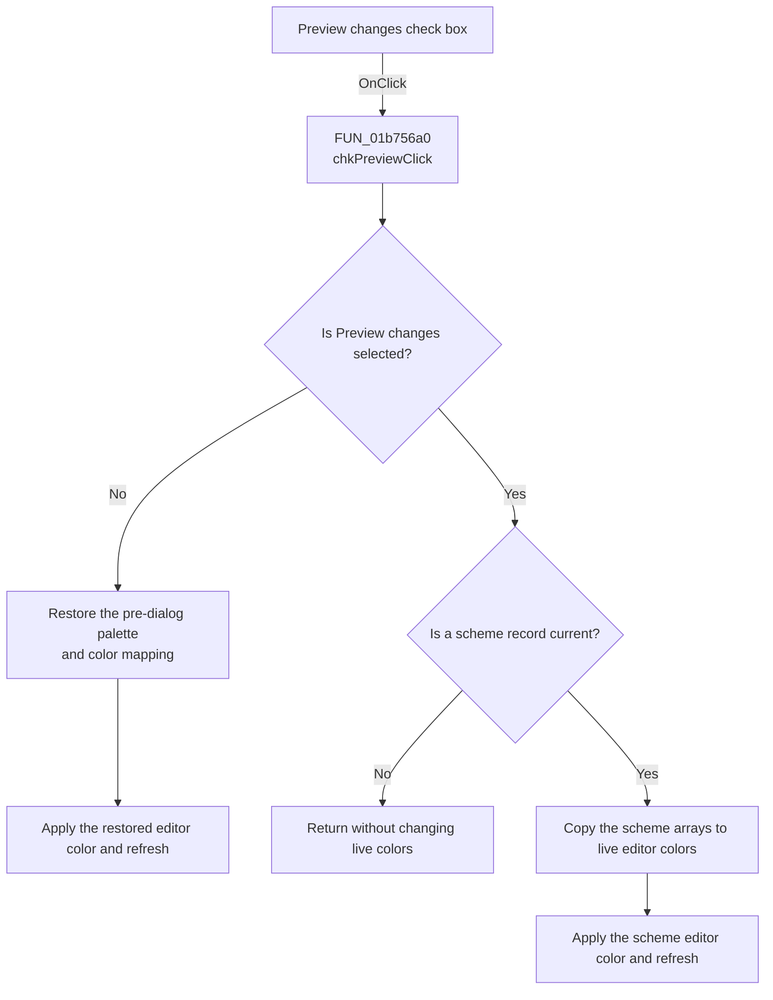

# &Preview changes

> Analysis status: Recovered temporary-preview toggle path reviewed.

## Control

| Property | Recovered value |
| --- | --- |
| Form | frmEditorSchemes |
| Component path | frmEditorSchemes.pnlMainButtons.chkPreview |
| Control class | TCheckBox |
| Caption | &Preview changes |
| Hint | Not present in the recovered resource. |
| Text | Not present in the recovered resource. |
| Handler name | chkPreviewClick |
| Handler address | 01b756a0 |
| Graph node | `resource:dfm:frmEditorSchemes/frmEditorSchemes.pnlMainButtons.chkPreview` |
| Handler node | `function:01b756a0` |
| Graph layer | UI |

## What happens when clicked

`chkPreviewClick` reads the check box state. The DFM initializes the check box
as selected.

When the user clears the check box, the handler copies the 27-color palette and
16-pair color mapping saved when the dialog opened back to the process-wide
editor arrays. It applies the restored first palette color to the active
schematic editor and refreshes that editor.

When the user selects the check box, the handler calls the shared preview
helper. If a scheme record is current, that helper copies its two color arrays
to the process-wide arrays, applies its first palette color to the active
editor, and refreshes the editor. With no current record, it does nothing.

`FormClose` restores the same pre-dialog arrays for every close result,
including OK. Preview changes are therefore temporary. OK can save edited
scheme definitions, but it does not keep these preview arrays active.

## Click flow

## Handler evidence

- Source: [FUN_01b756a0](../../../DecompiledSources/Tina16/functions/0000000001B756A0__FUN_01b756a0.c)
- Preview helper: [FUN_01b75500](../../../DecompiledSources/Tina16/functions/0000000001B75500__FUN_01b75500.c)
- Form initialization and backup: [FUN_01b73c00](../../../DecompiledSources/Tina16/functions/0000000001B73C00__FUN_01b73c00.c)
- Form close restore: [FUN_01b755e0](../../../DecompiledSources/Tina16/functions/0000000001B755E0__FUN_01b755e0.c)
- VCL color setter: [FUN_0064e030](../../../DecompiledSources/Tina16/functions/000000000064E030__FUN_0064e030.c)
- Recovered role: Selects between the current scheme preview and the saved
  pre-dialog editor colors.
- Current graph summary: Handles 1 Delphi UI event: frmEditorSchemes.pnlMainButtons.chkPreview.OnClick.
- Current graph behavior: Applies the current scheme when selected or restores
  the dialog-open snapshot when clear.
- Current graph evidence: `FUN_01b756a0` reads the Boolean getter from check box
  `+0x730`. The false branch copies form arrays `+0x854` and `+0x8C0` to
  `PTR_DAT_02003AD0` and `PTR_DAT_02005048`, calls `0064E030`, and calls the
  editor refresh VMT slot `+0x180`. The true branch calls `01B75500`.
- Complexity: moderate
- Distinct outgoing calls: 2

## Direct calls

- `function:0064e030` - changes the active editor VCL color and sends the
  color-change message when required.
- `function:01b75500` - applies the current scheme only when preview is selected.

## Resource evidence

- Caption: &Preview changes
- Checked state: true
- Control state: cbChecked
- Kind: Not present in the recovered resource.
- Modal result: Not present in the recovered resource.
- List items: Not present in the recovered resource.
- Image reference: Not present in the recovered resource.
- Extracted glyph: None.

## Nearby label candidates

- No same-parent label candidate is available.

## Analysis limits

- The original global and form field names are not recovered. The inverse
  copies in `FormCreate`, the preview helper, and `FormClose` establish the
  saved-snapshot and live-array roles.
- The click changes live display colors only. It does not save a scheme record
  or select a scheme in the parent Editor Options dialog.
- The recovered source does not show how a deeper editor refresh failure is
  reported.
