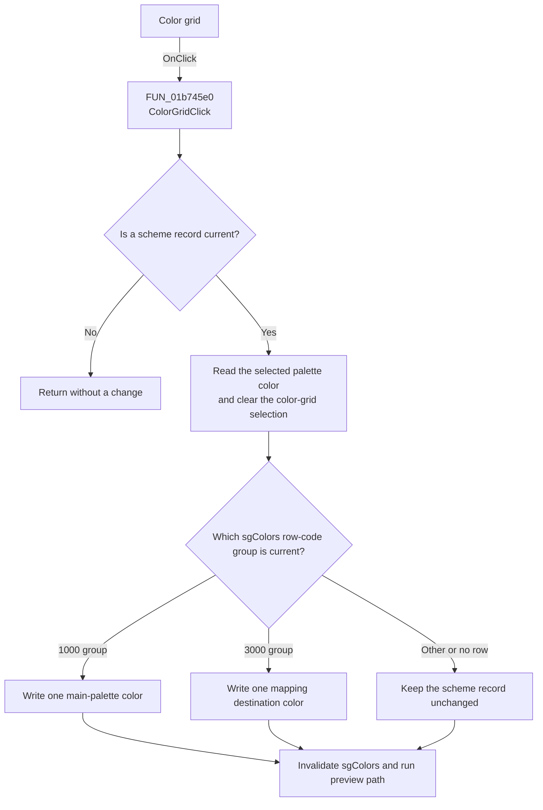

# Object color|Left click: border color -- Right click: fill color

> Analysis status: Recovered palette-color assignment path reviewed.

## Control

| Property | Recovered value |
| --- | --- |
| Form | frmEditorSchemes |
| Component path | frmEditorSchemes.pnlCurrentScheme.ColorGrid |
| Control class | TColorGrid |
| Caption | Not present in the recovered resource. |
| Hint | Object color\|Left click: border color -- Right click: fill color |
| Text | Not present in the recovered resource. |
| Handler name | ColorGridClick |
| Handler address | 01b745e0 |
| Graph node | `resource:dfm:frmEditorSchemes/frmEditorSchemes.pnlCurrentScheme.ColorGrid` |
| Handler node | `function:01b745e0` |
| Graph layer | UI |

## What happens when clicked

`ColorGridClick` first requires a current scheme record. If no record is
current, the handler returns without changing a color.

For a current record, the handler reads the selected `TColorGrid` color and
clears the color-grid selection. It then reads the recovered code for the
current `sgColors` row:

- A code in the `1000` group writes the selected color to the corresponding
  entry in the scheme's 27-color main palette.
- A code in the `3000` group writes the selected color to the second value of
  the corresponding entry in the scheme's 16-pair color mapping.
- No selected row or another code group does not change the scheme record.

The handler invalidates `sgColors` after this processing. It also calls the
shared preview path. That path copies the scheme palettes to the live editor
colors and refreshes the editor only when **Preview changes** is selected.
Otherwise, the edit stays in the dialog record until the user selects OK.

## Click flow

## Handler evidence

- Source: [FUN_01b745e0](../../../DecompiledSources/Tina16/functions/0000000001B745E0__FUN_01b745e0.c)
- Color-grid selected-color reader: [FUN_00c56640](../../../DecompiledSources/Tina16/functions/0000000000C56640__FUN_00c56640.c)
- Color-grid selection setter: [FUN_00c56db0](../../../DecompiledSources/Tina16/functions/0000000000C56DB0__FUN_00c56db0.c)
- Grid cell-code reader: [FUN_0084e390](../../../DecompiledSources/Tina16/functions/000000000084E390__FUN_0084e390.c)
- Preview helper: [FUN_01b75500](../../../DecompiledSources/Tina16/functions/0000000001B75500__FUN_01b75500.c)
- Recovered role: Assigns a fixed palette color to the current scheme field
  selected in `sgColors`.
- Current graph summary: Handles 1 Delphi UI event: frmEditorSchemes.pnlCurrentScheme.ColorGrid.OnClick.
- Current graph behavior: Updates one recognized color field, invalidates the
  scheme grid, and runs the conditional preview path.
- Current graph evidence: `FUN_01b745e0` requires record pointer `+0x748`,
  reads `ColorGrid` at `+0x708`, uses the current row from `sgColors` at
  `+0x700`, writes record array `+0x104` for code group 1 or array member
  `+0x174` for code group 3, then calls `0064E770` and `01B75500`.
- Complexity: complex
- Distinct outgoing calls: 5

## Direct calls

- `function:0064e770` - invalidates a VCL control.
- `function:0084e390` - reads the recovered object code stored for a grid cell.
- `function:00c56640` - returns the selected `TColorGrid` color.
- `function:00c56db0` - changes the `TColorGrid` selection and sends its change
  notification when required.
- `function:01b75500` - conditionally applies the current scheme as a preview.

## Resource evidence

- Hint: Object color|Left click: border color -- Right click: fill color
- Kind: Not present in the recovered resource.
- Modal result: Not present in the recovered resource.
- Checked state: Not present in the recovered resource.
- List items: Not present in the recovered resource.
- Image reference: Not present in the recovered resource.
- Extracted glyph: None.

## Nearby label candidates

- No same-parent label candidate is available.

## Analysis limits

- The handler receives no mouse-button argument and has no left-button or
  right-button branch. The resource hint does not prove a separate right-click
  implementation in this `OnClick` path.
- The original names for the grid row-code groups and the record arrays are not
  recovered. Form initialization, cell drawing, array sizes, and save code
  establish the main-palette and paired-mapping roles.
- Changes remain in memory until OK rewrites the scheme section. Closing the
  dialog restores the live colors that existed before the dialog opened.
