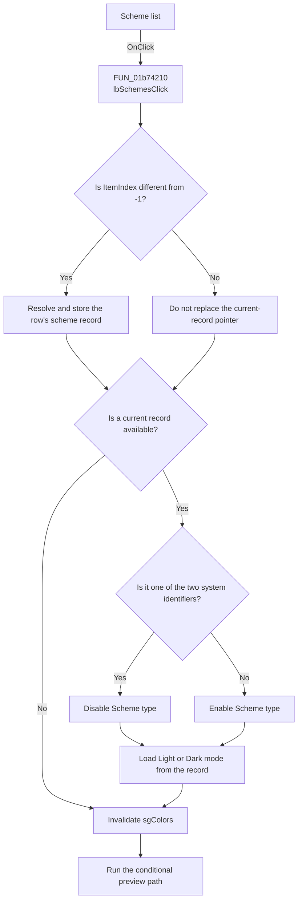

# lbSchemes

> Analysis status: Recovered scheme-selection and preview path reviewed.

## Control

| Property | Recovered value |
| --- | --- |
| Form | frmEditorSchemes |
| Component path | frmEditorSchemes.pnlSchemes.lbSchemes |
| Control class | TListBox |
| Caption | Not present in the recovered resource. |
| Hint | Not present in the recovered resource. |
| Text | Not present in the recovered resource. |
| Handler name | lbSchemesClick |
| Handler address | 01b74210 |
| Graph node | `resource:dfm:frmEditorSchemes/frmEditorSchemes.pnlSchemes.lbSchemes` |
| Handler node | `function:01b74210` |
| Graph layer | UI |

## What happens when clicked

`lbSchemesClick` reads the list ItemIndex. For an index other than `-1`, it
gets the scheme record associated with that row and stores it as the dialog's
current record.

For a current record, the handler compares its fixed identifier with the two
system-scheme identifiers. It disables the **Scheme type** radio group for a
system record and enables it for another record. It then sets the radio-group
row from the record's mode byte: `0` is Light and `1` is Dark.

The handler always invalidates `sgColors` and calls the shared preview helper.
If **Preview changes** is selected and a record is current, the helper copies
that record's palette and mapping to the live editor arrays and refreshes the
schematic editor.

If ItemIndex is `-1`, this handler does not clear an older current-record
pointer by itself. Other paths, such as confirmed deletion, clear that pointer
before they remove a row and call this handler.

## Click flow

## Handler evidence

- Source: [FUN_01b74210](../../../DecompiledSources/Tina16/functions/0000000001B74210__FUN_01b74210.c)
- Preview helper: [FUN_01b75500](../../../DecompiledSources/Tina16/functions/0000000001B75500__FUN_01b75500.c)
- Form scheme loader: [FUN_01b73970](../../../DecompiledSources/Tina16/functions/0000000001B73970__FUN_01b73970.c)
- Mode handler: [FUN_01b755b0](../../../DecompiledSources/Tina16/functions/0000000001B755B0__FUN_01b755b0.c)
- Recovered role: Resolves the selected scheme record, updates its mode control,
  redraws the color grid, and applies the conditional preview.
- Current graph summary: Handles 1 Delphi UI event: frmEditorSchemes.pnlSchemes.lbSchemes.OnClick.
- Current graph behavior: Makes a selected row current, protects system-scheme
  mode values, loads the record mode, and refreshes the display.
- Current graph evidence: `FUN_01b74210` reads ItemIndex from list `+0x6F8`,
  gets the associated record from its item collection, stores it at `+0x748`,
  compares the record's leading fixed string with two constants, calls the
  enabled-state VMT slot on radio group `+0x738`, sets its ItemIndex from record
  byte `+0x100`, invalidates grid `+0x700`, and calls `01B75500`.
- Complexity: complex
- Distinct outgoing calls: 4

## Direct calls

- `function:00414f50` - compares the fixed scheme identifiers.
- `function:0064e770` - invalidates `sgColors`.
- `function:0074b490` - sets the radio-group ItemIndex.
- `function:01b75500` - conditionally previews the current scheme.

## Resource evidence

- Same-parent label: Sc&hemes at distance 17
- Kind: Not present in the recovered resource.
- Modal result: Not present in the recovered resource.
- Checked state: Not present in the recovered resource.
- List items: Not present in the recovered resource.
- Image reference: Not present in the recovered resource.
- Extracted glyph: None.

## Nearby label candidates

- Rank 1: Sc&hemes at distance 17. The handler's ItemIndex and item-object
  access confirms that this label names the scheme list.

## Analysis limits

- The original Delphi constant names for the two system identifiers are not
  recovered.
- ItemIndex `-1` is not a complete clear operation in this handler because it
  retains the previous current pointer. Normal delete code clears the pointer
  separately.
- Preview is temporary. `FormClose` restores the colors saved when the dialog
  opened.
