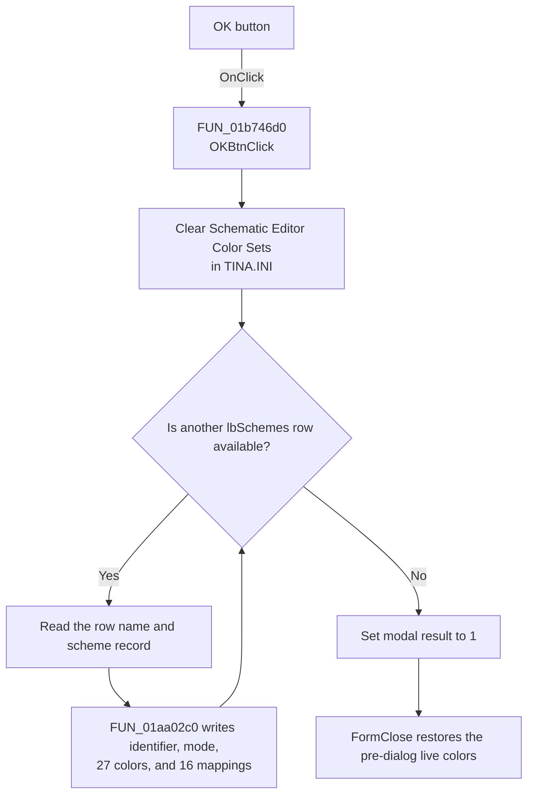

# OK

> Analysis status: Recovered scheme persistence and modal acceptance path reviewed.

## Control

| Property | Recovered value |
| --- | --- |
| Form | frmEditorSchemes |
| Component path | frmEditorSchemes.pnlMainButtons.OKBtn |
| Control class | TBitBtn |
| Caption | OK |
| Hint | Not present in the recovered resource. |
| Text | Not present in the recovered resource. |
| Handler name | OKBtnClick |
| Handler address | 01b746d0 |
| Graph node | `resource:dfm:frmEditorSchemes/frmEditorSchemes.pnlMainButtons.OKBtn` |
| Handler node | `function:01b746d0` |
| Graph layer | UI |

## What happens when clicked

`OKBtnClick` clears the existing `Schematic Editor Color Sets` section in the
dialog's `TINA.INI` settings object. It then visits every row in `lbSchemes`.
For each row, it passes the visible name and the associated scheme record to
the shared serializer. The serializer writes the fixed identifier, Light or
Dark mode, 27 main colors, and 16 color-mapping pairs.

After all rows are processed, the handler sets the form modal result to `1`.
This accepts and closes the modal dialog. The dialog close path restores the
live editor colors that existed when the dialog opened, so this click persists
the definitions but does not keep the temporary preview active. The launcher
then rebuilds its parent color-scheme list from the saved INI records.

The writes are sequential. The handler has no validation, transaction, local
exception handler, success message, retry, or rollback path.

## Click flow

## Handler evidence

- Source: [FUN_01b746d0](../../../DecompiledSources/Tina16/functions/0000000001B746D0__FUN_01b746d0.c)
- Scheme serializer: [FUN_01aa02c0](../../../DecompiledSources/Tina16/functions/0000000001AA02C0__FUN_01aa02c0.c)
- Form close path: [FUN_01b755e0](../../../DecompiledSources/Tina16/functions/0000000001B755E0__FUN_01b755e0.c)
- Modal launcher: [FUN_01b7c440](../../../DecompiledSources/Tina16/functions/0000000001B7C440__FUN_01b7c440.c)
- Recovered role: Rewrites all editor color schemes in application settings and
  accepts the modal dialog.
- Current graph summary: Handles 1 Delphi UI event: frmEditorSchemes.pnlMainButtons.OKBtn.OnClick.
- Current graph behavior: Clears the saved scheme section, serializes every
  current list record, and sets modal result `1`.
- Current graph evidence: `FUN_01b746d0` calls settings VMT slot `+0xB8` with
  `Schematic Editor Color Sets`, loops through the collection owned by
  `lbSchemes` at `+0x6F8`, calls `01AA02C0` for each row, and writes `1` to the
  form modal-result field at `+0x508`.
- Complexity: complex
- Distinct outgoing calls: 3

## Direct calls

- `function:00414560` - finalizes two temporary Delphi UnicodeStrings.
- `function:004169a0` - converts the record's fixed identifier for the writer.
- `function:01aa02c0` - serializes one indexed scheme record to the INI section.

## Resource evidence

- Caption: OK
- Default button: true
- Kind: Not present in the recovered resource.
- Modal result: Not present in the recovered resource.
- Checked state: Not present in the recovered resource.
- List items: Not present in the recovered resource.
- Image reference: Not present in the recovered resource.
- Extracted glyph: [`0185_frmEditorSchemes_frmEditorSchemes_pnlMainButtons_OKBtn_Glyph_Data.png`](../../../glyph/0185_frmEditorSchemes_frmEditorSchemes_pnlMainButtons_OKBtn_Glyph_Data.png)
- Glyph inspection: two check-mark states support an acceptance action. The
  handler and modal-result write establish the implementation.

## Nearby label candidates

- No same-parent label candidate is available.

## Analysis limits

- The settings virtual method name is not present in the recovered C source.
  Its section-clear role is established by the settings class path and by the
  subsequent full rewrite of every indexed record.
- A failure during one of the ordered settings writes can leave a partial
  section. The recovered path has no atomic replacement or rollback.
- Saving these definitions is separate from the outer Editor Options OK action,
  which selects and applies one saved scheme as the active scheme.
