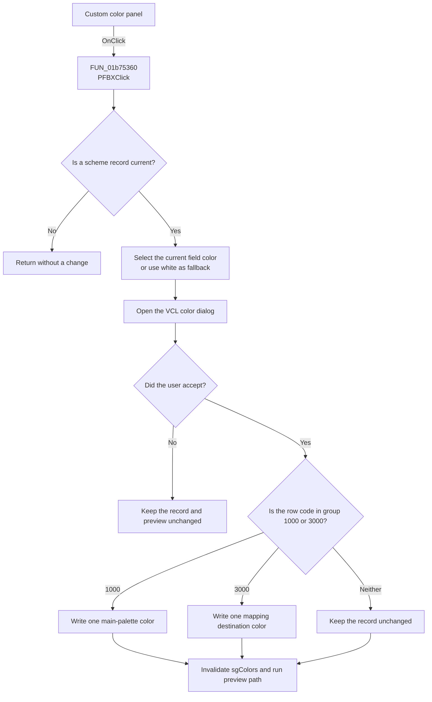

# Custom

> Analysis status: Recovered custom-color dialog path reviewed.

## Control

| Property | Recovered value |
| --- | --- |
| Form | frmEditorSchemes |
| Component path | frmEditorSchemes.pnlCurrentScheme.PFBX |
| Control class | TPanel |
| Caption | Custom |
| Hint | Transparent\|Right click: transparent fill |
| Text | Not present in the recovered resource. |
| Handler name | PFBXClick |
| Handler address | 01b75360 |
| Graph node | `resource:dfm:frmEditorSchemes/frmEditorSchemes.pnlCurrentScheme.PFBX` |
| Handler node | `function:01b75360` |
| Graph layer | UI |

## What happens when clicked

`PFBXClick` first requires a current scheme record. It uses the current
`sgColors` row code to choose the existing color for a `TColorDialog`:

- A `1000`-group code uses the matching main-palette color.
- A `3000`-group code uses the second value of the matching color-mapping pair.
- No valid row or another group uses white as the dialog's initial color.

If the user cancels the color dialog, the handler returns without changing the
record or refreshing the preview. If the user accepts, it reads the selected
custom color. It stores the color only for the two recognized code groups. It
then invalidates `sgColors` and runs the conditional preview path.

## Click flow

## Handler evidence

- Source: [FUN_01b75360](../../../DecompiledSources/Tina16/functions/0000000001B75360__FUN_01b75360.c)
- Grid cell-code reader: [FUN_0084e390](../../../DecompiledSources/Tina16/functions/000000000084E390__FUN_0084e390.c)
- Preview helper: [FUN_01b75500](../../../DecompiledSources/Tina16/functions/0000000001B75500__FUN_01b75500.c)
- Recovered role: Opens the custom-color dialog for the current editable scheme
  field and stores an accepted color.
- Current graph summary: Handles 1 Delphi UI event: frmEditorSchemes.pnlCurrentScheme.PFBX.OnClick.
- Current graph behavior: Seeds the color dialog from the current scheme field,
  conditionally stores an accepted color, then redraws and previews.
- Current graph evidence: `FUN_01b75360` requires record pointer `+0x748`,
  reads the selected row code from grid `+0x700`, initializes `ColorDialog` at
  `+0x728`, calls its execute slot `+0xA8`, and reads its color at `+0xD0` only
  on acceptance. It writes record `+0x104` for group 1 or `+0x174` for group 3.
- Complexity: complex
- Distinct outgoing calls: 3

## Direct calls

- `function:0064e770` - invalidates `sgColors` after an accepted dialog.
- `function:0084e390` - reads the recovered object code stored for a grid cell.
- `function:01b75500` - conditionally applies the current scheme as a preview.

## Resource evidence

- Caption: Custom
- Hint: Transparent|Right click: transparent fill
- Kind: Not present in the recovered resource.
- Modal result: Not present in the recovered resource.
- Checked state: Not present in the recovered resource.
- List items: Not present in the recovered resource.
- Image reference: Not present in the recovered resource.
- Extracted glyph: None.

## Nearby label candidates

- No same-parent label candidate is available.

## Analysis limits

- The recovered handler opens a standard color dialog. It does not contain a
  transparency value, a mouse-button test, or a right-click branch. The hint
  alone is not enough to claim transparent-fill behavior here.
- An accepted color with no recognized grid row causes only a redraw and the
  conditional preview call. It does not write a scheme field.
- Changes remain in memory until OK rewrites the scheme section.
