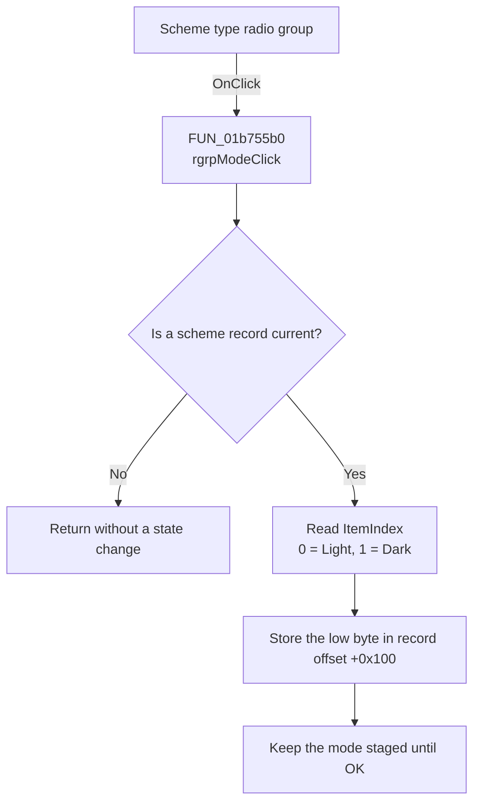

# Scheme type

> Analysis status: Recovered scheme-mode assignment path reviewed.

## Control

| Property | Recovered value |
| --- | --- |
| Form | frmEditorSchemes |
| Component path | frmEditorSchemes.pnlSchemes.rgrpMode |
| Control class | TRadioGroup |
| Caption | Scheme type |
| Hint | Not present in the recovered resource. |
| Text | Not present in the recovered resource. |
| Handler name | rgrpModeClick |
| Handler address | 01b755b0 |
| Graph node | `resource:dfm:frmEditorSchemes/frmEditorSchemes.pnlSchemes.rgrpMode` |
| Handler node | `function:01b755b0` |
| Graph layer | UI |

## What happens when clicked

`rgrpModeClick` checks whether a scheme record is current. If not, it returns
without a state change. For a current record, it copies the radio group's
ItemIndex to the record's mode byte. The DFM item order maps index `0` to
**Light** and index `1` to **Dark**.

This handler does not redraw the color grid, apply a preview, save to the INI
file, or close the dialog. OK later serializes the mode with the rest of the
record.

The normal list-selection path disables this radio group for the two system
scheme identifiers. The mode handler itself does not repeat that identifier
check.

## Click flow

## Handler evidence

- Source: [FUN_01b755b0](../../../DecompiledSources/Tina16/functions/0000000001B755B0__FUN_01b755b0.c)
- List-selection guard and restore: [FUN_01b74210](../../../DecompiledSources/Tina16/functions/0000000001B74210__FUN_01b74210.c)
- Scheme serializer: [FUN_01aa02c0](../../../DecompiledSources/Tina16/functions/0000000001AA02C0__FUN_01aa02c0.c)
- Recovered role: Stages the selected Light or Dark mode in the current scheme
  record.
- Current graph summary: Handles 1 Delphi UI event: frmEditorSchemes.pnlSchemes.rgrpMode.OnClick.
- Current graph behavior: Copies the radio-group ItemIndex to the current
  record's mode byte.
- Current graph evidence: `FUN_01b755b0` requires record pointer `+0x748` and
  copies the low byte of radio-group field `+0x738` offset `+0x4A8` to record
  byte `+0x100`. `FUN_01b74210` performs the inverse assignment when a record
  becomes current.
- Complexity: simple
- Distinct outgoing calls: 0

## Direct calls

- No direct call edge is present in the recovered graph.

## Resource evidence

- Caption: Scheme type
- List items: ("Light", "Dark")
- Kind: Not present in the recovered resource.
- Modal result: Not present in the recovered resource.
- Checked state: Not present in the recovered resource.
- Image reference: Not present in the recovered resource.
- Extracted glyph: None.

## Nearby label candidates

- Rank 1: Sc&hemes at distance 339. The record write and inverse selection path,
  not proximity, establish the mode behavior.

## Analysis limits

- The source writes the low byte of ItemIndex without a local range check. The
  normal UI exposes only the two recovered DFM rows.
- A programmatic handler call could change a protected record because this
  function has no system-identifier check. The normal UI disables the control
  for those records.
- Mode changes do not run the preview path in this handler.
