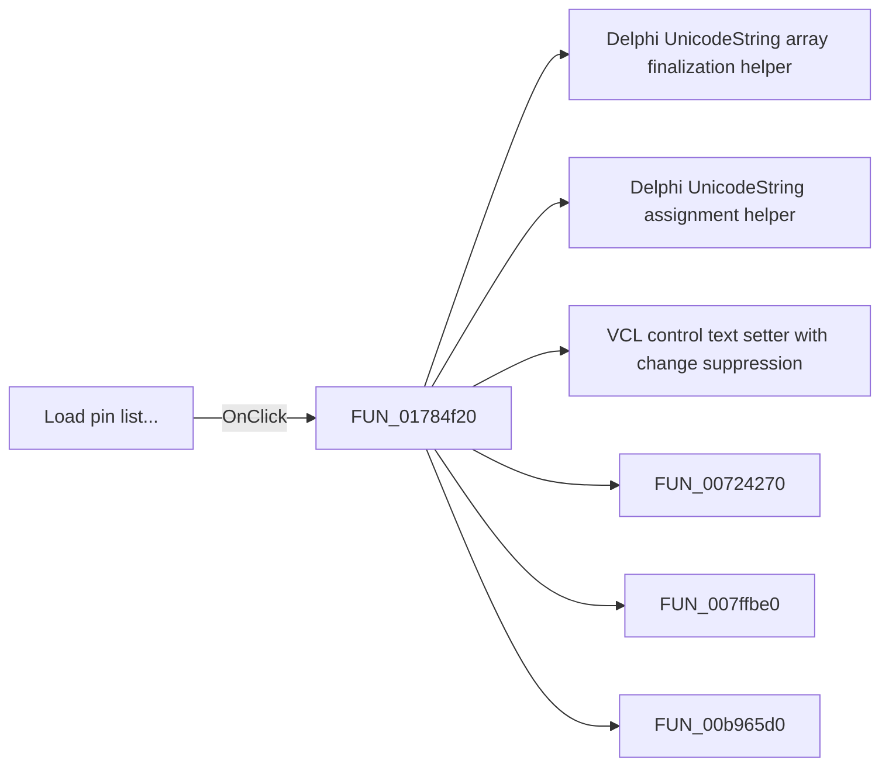

# Load pin list...

> Analysis status: Pending individual source review.

## Control

| Property | Recovered value |
| --- | --- |
| Form | frmICWizard |
| Component path | frmICWizard.gbPinLayout.btnLoadList |
| Control class | TButton |
| Caption | Load pin list... |
| Hint | Not present in the recovered resource. |
| Text | Not present in the recovered resource. |
| Handler name | btnLoadListClick |
| Handler address | 01784f20 |
| Graph node | `resource:dfm:frmICWizard/frmICWizard.gbPinLayout.btnLoadList` |
| Handler node | `function:01784f20` |
| Graph layer | UI |

## What happens when clicked

Pending individual analysis. An agent must read the recovered handler source and its relevant callees before it replaces this text.

## Click flow

## Handler evidence

- Source: [DecompiledSources/Tina16/functions/0000000001784F20__FUN_01784f20.c](../../../DecompiledSources/Tina16/functions/0000000001784F20__FUN_01784f20.c)
- Recovered role: Not present in the recovered resource.
- Current graph summary: Handles 1 Delphi UI event: frmICWizard.gbPinLayout.btnLoadList.OnClick.
- Current graph behavior: Not present in the recovered resource.
- Current graph evidence: Not present in the recovered resource.
- Complexity: complex
- Distinct outgoing calls: 7

## Direct calls

- `function:00414560` — Delphi UnicodeString array finalization helper
- `function:00414ad0` — Delphi UnicodeString assignment helper
- `function:0064de00` — VCL control text setter with change suppression
- `function:00724270` — FUN_00724270
- `function:007ffbe0` — FUN_007ffbe0
- `function:00b965d0` — FUN_00b965d0
- `function:01785490` — FUN_01785490

## Resource evidence

- Kind: Not present in the recovered resource.
- Modal result: Not present in the recovered resource.
- Checked state: Not present in the recovered resource.
- List items: Not present in the recovered resource.
- Image reference: Not present in the recovered resource.
- Extracted glyph: None.

## Nearby label candidates

Nearby labels are layout candidates only. They are not proof of behavior.

- Rank 1: Color of pin labels at distance 66.
- Rank 2: Number of pins at distance 93.

## Analysis limits

- Do not infer behavior from the control class, caption, hint, glyph, or nearby label alone.
- Do not replace the pending status until the handler source and relevant call path provide enough evidence.
