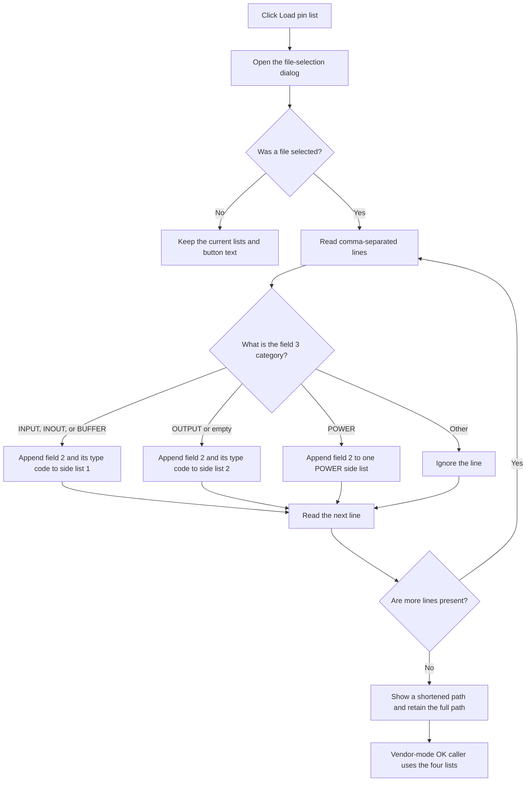

# Load pin list...

> Analysis status: Reviewed from the recovered handler, file parser, path-display helper, and IC Wizard caller.

## Control

| Property | Recovered value |
| --- | --- |
| Form | frmICWizard |
| Component path | frmICWizard.gbPinLayout.btnLoadList |
| Control class | TButton |
| Caption | Load pin list... |
| Hint | Not present in the recovered resource. |
| Text | Not present in the recovered resource. |
| Handler name | btnLoadListClick |
| Handler address | 01784f20 |
| Graph node | `resource:dfm:frmICWizard/frmICWizard.gbPinLayout.btnLoadList` |
| Handler node | `function:01784f20` |
| Graph layer | UI |

## What happens when clicked

This button opens the form's file-open dialog. If the user cancels the dialog, the handler does not parse a file and does not change the four pin lists or the button text.

If the user selects a file, the handler passes its full path to the pin-list parser. The parser reads comma-separated lines. It uses field 2 as the pin name and field 3 as the upper-case pin category. `INPUT`, `INOUT`, and `BUFFER` entries go to one side list with type codes 0, 2, and 4. `OUTPUT` and an empty category go to another side list with type codes 1 and 4. `POWER` entries go to one of two remaining side lists with type code 3. The two recovered name tests that select the POWER side are not identified. Other categories are ignored.

After a successful selection, the handler shortens the displayed path to fit the button width and stores the full selected path in the button string field at offset `+0xf0`. It does not clear the four lists before parsing. Therefore, another successful load appends entries. A canceled load preserves prior list data and button state.

The loader does not create drawing objects. After the wizard returns OK in Vendor mode, the caller uses the four lists, their pin names, and their type codes to create pins on four sides of the IC outline. File I/O uses the Delphi text-file runtime. No local recovery path is present in this handler or parser.

## Click flow

## Handler evidence

- Source: [DecompiledSources/Tina16/functions/0000000001784F20__FUN_01784f20.c](../../../DecompiledSources/Tina16/functions/0000000001784F20__FUN_01784f20.c)
- Recovered role: Select and load a vendor pin-list file for the IC Wizard.
- Current graph summary: Handles 1 Delphi UI event: frmICWizard.gbPinLayout.btnLoadList.OnClick.
- Current graph behavior: Not present in the recovered resource.
- Current graph evidence: Not present in the recovered resource.
- Complexity: complex
- Distinct outgoing calls: 7

## Direct calls

- `function:00414560` — Delphi UnicodeString array finalization helper
- `function:00414ad0` — Delphi UnicodeString assignment helper
- `function:0064de00` — VCL control text setter with change suppression
- `function:00724270` — FUN_00724270
- `function:007ffbe0` — FUN_007ffbe0
- `function:00b965d0` — FUN_00b965d0
- `function:01785490` — FUN_01785490

## Related source evidence

- [File-name reader](../../../DecompiledSources/Tina16/functions/0000000000724270__FUN_00724270.c) returns the selected open-dialog path.
- [Pin-list parser](../../../DecompiledSources/Tina16/functions/0000000001785490__FUN_01785490.c) reads lines, classifies the third field, and appends the second field to one of four lists.
- [Comma-field extractor](../../../DecompiledSources/Tina16/functions/0000000001785360__FUN_01785360.c) extracts a requested comma-separated field.
- [Path-display shortener](../../../DecompiledSources/Tina16/functions/0000000000B965D0__FUN_00b965d0.c) preserves the drive and file name where possible and replaces intermediate directory text with an ellipsis until the path fits.
- [IC Wizard caller](../../../DecompiledSources/Tina16/functions/000000000179E030__FUN_0179e030.c) consumes the four lists only after an accepted Vendor-mode dialog.

## Resource evidence

- Kind: Not present in the recovered resource.
- Modal result: Not present in the recovered resource.
- Checked state: Not present in the recovered resource.
- List items: Not present in the recovered resource.
- Image reference: Not present in the recovered resource.
- Extracted glyph: None.

## Nearby label candidates

Nearby labels are layout candidates only. They are not proof of behavior.

- Rank 1: Color of pin labels at distance 66.
- Rank 2: Number of pins at distance 93.

## Analysis limits

- The recovered source does not identify the two POWER pin-name tests that select between the two POWER side lists.
- The recovered source proves the full path is assigned to the button string field at offset `+0xf0`; it does not name that field.
- The parser treats commas as separators. No quoted-field or escaped-comma handling is visible.
