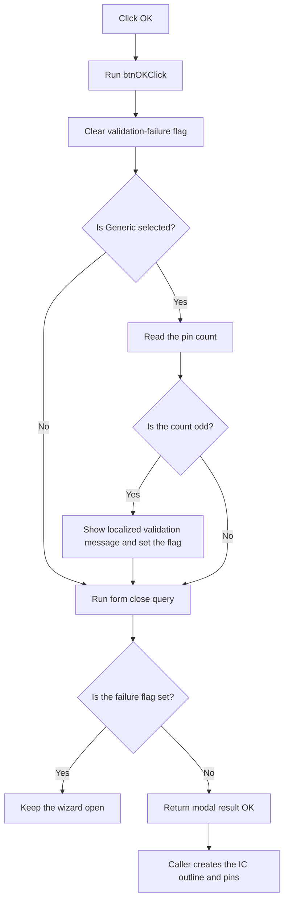

# btnOK

> Analysis status: Reviewed from the recovered handler, validation path, form close guard, and IC Wizard caller.

## Control

| Property | Recovered value |
| --- | --- |
| Form | frmICWizard |
| Component path | frmICWizard.btnOK |
| Control class | TBitBtn |
| Caption | Not present in the recovered resource. |
| Hint | Not present in the recovered resource. |
| Text | Not present in the recovered resource. |
| Handler name | btnOKClick |
| Handler address | 01784f10 |
| Graph node | `resource:dfm:frmICWizard/frmICWizard.btnOK` |
| Handler node | `function:01784f10` |
| Graph layer | UI |

## What happens when clicked

This button is the dialog's built-in `bkOK` button. Its click handler starts one validation attempt. It clears the form's validation-failure flag and reads the pin count. If **Generic** is selected and the count is odd, the validator gets localized message resource `0x134`, shows the message, and sets the failure flag. The exact localized message text is not present in the recovered source.

The form's close-query handler checks the same flag when the modal result is OK. It refuses to close the dialog after a failed attempt. A new click clears the flag first, so the user can correct the value and try again. Vendor mode does not use this even-count test.

The click handler does not create the IC. After a successful modal close, the caller creates the IC outline and pins. Generic mode creates equally divided, sequentially numbered pins on two opposite sides. Vendor mode uses the four lists that the pin-list loader filled. Cancel or failed validation does not enter this generation path.

## Click flow

## Handler evidence

- Source: [DecompiledSources/Tina16/functions/0000000001784F10__FUN_01784f10.c](../../../DecompiledSources/Tina16/functions/0000000001784F10__FUN_01784f10.c)
- Recovered role: Validate the IC Wizard pin count before an OK modal close.
- Current graph summary: Handles 1 Delphi UI event: frmICWizard.btnOK.OnClick.
- Current graph behavior: Not present in the recovered resource.
- Current graph evidence: Not present in the recovered resource.
- Complexity: simple
- Distinct outgoing calls: 1

## Direct calls

- `function:01785270` — FUN_01785270

## Related source evidence

- [Validation routine](../../../DecompiledSources/Tina16/functions/0000000001785270__FUN_01785270.c) clears the failure flag and rejects an odd count only when Generic is selected.
- [Validation message routine](../../../DecompiledSources/Tina16/functions/00000000017851F0__FUN_017851f0.c) shows one message per attempt and sets the failure flag.
- [Form close-query handler](../../../DecompiledSources/Tina16/functions/0000000001784DE0__FUN_01784de0.c) keeps the dialog open when the modal result is OK and the failure flag is set.
- [IC Wizard caller](../../../DecompiledSources/Tina16/functions/000000000179E030__FUN_0179e030.c) creates the outline and pins only after the dialog returns OK.

## Resource evidence

- Kind: bkOK
- Modal result: Not present in the recovered resource.
- Checked state: Not present in the recovered resource.
- List items: Not present in the recovered resource.
- Image reference: Not present in the recovered resource.
- Extracted glyph: None.

## Nearby label candidates

Nearby labels are layout candidates only. They are not proof of behavior.

- No same-parent label candidate is available.

## Analysis limits

- The recovered source refers to localized string resource `0x134`, but it does not contain the resolved message text.
- The `TIntEdit` and up-down controls enforce their own numeric conversion and range behavior. This handler adds only the Generic-mode even-count rule.
