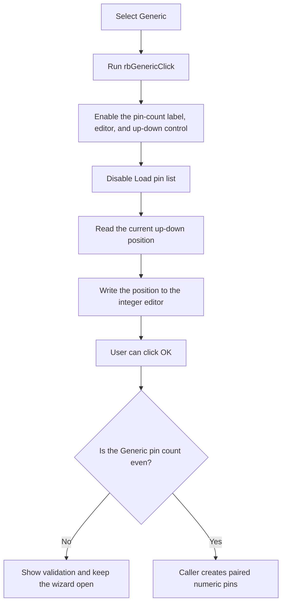

# Generic

> Analysis status: Reviewed from the recovered mode handler, form initialization, validation path, and IC Wizard caller.

## Control

| Property | Recovered value |
| --- | --- |
| Form | frmICWizard |
| Component path | frmICWizard.gbPinLayout.rbGeneric |
| Control class | TRadioButton |
| Caption | Generic |
| Hint | Not present in the recovered resource. |
| Text | Not present in the recovered resource. |
| Handler name | rbGenericClick |
| Handler address | 01784e00 |
| Graph node | `resource:dfm:frmICWizard/frmICWizard.gbPinLayout.rbGeneric` |
| Handler node | `function:01784e00` |
| Graph layer | UI |

## What happens when clicked

This radio button selects the Generic pin-layout mode. Its handler enables the pin-count label, integer editor, and up-down control. It disables **Load pin list...**. It then reads the current up-down position and writes that value to the integer editor.

Generic is checked in the recovered form resource. The form-create handler calls this same mode handler, so these control states are also applied when the wizard opens. A repeated click applies the same states again and synchronizes the editor with the current up-down value. The handler does not clear or change the vendor pin lists.

When the user later clicks OK, the validator requires an even Generic pin count. After an accepted dialog, the caller divides the count by two and creates sequentially numbered pins on two opposite sides of the IC outline. This click does not create the outline or pins itself.

## Click flow

## Handler evidence

- Source: [DecompiledSources/Tina16/functions/0000000001784E00__FUN_01784e00.c](../../../DecompiledSources/Tina16/functions/0000000001784E00__FUN_01784e00.c)
- Recovered role: Configure the IC Wizard controls for Generic pin-count input.
- Current graph summary: Handles 1 Delphi UI event: frmICWizard.gbPinLayout.rbGeneric.OnClick.
- Current graph behavior: Not present in the recovered resource.
- Current graph evidence: Not present in the recovered resource.
- Complexity: moderate
- Distinct outgoing calls: 2

## Direct calls

- `function:006ec320` — FUN_006ec320
- `function:00f04fa0` — FUN_00f04fa0

## Related source evidence

- [Up-down value reader](../../../DecompiledSources/Tina16/functions/00000000006EC320__FUN_006ec320.c) supplies the current position.
- [Integer editor formatter](../../../DecompiledSources/Tina16/functions/0000000000F04FA0__FUN_00f04fa0.c) writes the position to the integer editor.
- [Generic-mode validator](../../../DecompiledSources/Tina16/functions/0000000001785270__FUN_01785270.c) rejects an odd count when this radio button is checked.
- [IC Wizard caller](../../../DecompiledSources/Tina16/functions/000000000179E030__FUN_0179e030.c) creates the numeric pins after the dialog returns OK.

## Resource evidence

- Kind: Not present in the recovered resource.
- Modal result: Not present in the recovered resource.
- Checked state: true
- List items: Not present in the recovered resource.
- Image reference: Not present in the recovered resource.
- Extracted glyph: None.

## Nearby label candidates

Nearby labels are layout candidates only. They are not proof of behavior.

- Rank 1: Number of pins at distance 44.
- Rank 2: Color of pin labels at distance 71.

## Analysis limits

- The click handler only configures input controls. It does not create or clear pin data.
