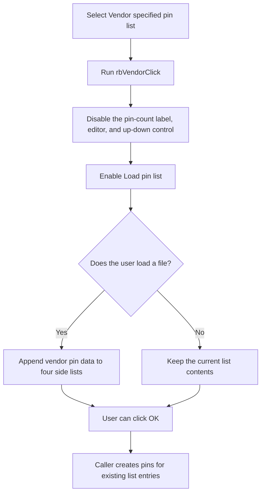

# Vendor specified pin list

> Analysis status: Reviewed from the recovered mode handler, pin-list loader, and IC Wizard caller.

## Control

| Property | Recovered value |
| --- | --- |
| Form | frmICWizard |
| Component path | frmICWizard.gbPinLayout.rbVendor |
| Control class | TRadioButton |
| Caption | Vendor specified pin list |
| Hint | Not present in the recovered resource. |
| Text | Not present in the recovered resource. |
| Handler name | rbVendorClick |
| Handler address | 01784ea0 |
| Graph node | `resource:dfm:frmICWizard/frmICWizard.gbPinLayout.rbVendor` |
| Handler node | `function:01784ea0` |
| Graph layer | UI |

## What happens when clicked

This radio button selects the Vendor pin-list mode. Its handler disables the pin-count label, integer editor, and up-down control. It enables **Load pin list...**.

The handler does not open a file, parse data, clear a previous pin list, or create an IC. It only changes which input controls are available. A repeated click applies the same enabled states again.

The load button can then append vendor pin names and type codes to four side lists. When the user later clicks OK, the even-count check is bypassed in Vendor mode. After an accepted dialog, the caller uses the current list entries to create the four sets of IC pins. The recovered accepted path does not require a nonempty list before it starts IC generation; each pin loop runs only for entries that exist.

## Click flow

## Handler evidence

- Source: [DecompiledSources/Tina16/functions/0000000001784EA0__FUN_01784ea0.c](../../../DecompiledSources/Tina16/functions/0000000001784EA0__FUN_01784ea0.c)
- Recovered role: Configure the IC Wizard controls for a vendor pin-list input.
- Current graph summary: Handles 1 Delphi UI event: frmICWizard.gbPinLayout.rbVendor.OnClick.
- Current graph behavior: Not present in the recovered resource.
- Current graph evidence: Not present in the recovered resource.
- Complexity: simple
- Distinct outgoing calls: 0

## Direct calls

- No direct call edge is present in the recovered graph.

## Related source evidence

- [Pin-list button handler](../../../DecompiledSources/Tina16/functions/0000000001784F20__FUN_01784f20.c) opens the file dialog and sends a selected file to the parser.
- [Pin-list parser](../../../DecompiledSources/Tina16/functions/0000000001785490__FUN_01785490.c) appends pin names and type codes to four side lists.
- [OK validator](../../../DecompiledSources/Tina16/functions/0000000001785270__FUN_01785270.c) applies the even-count rule only when Generic is selected.
- [IC Wizard caller](../../../DecompiledSources/Tina16/functions/000000000179E030__FUN_0179e030.c) uses the current four lists after an accepted Vendor-mode dialog.

## Resource evidence

- Kind: Not present in the recovered resource.
- Modal result: Not present in the recovered resource.
- Checked state: Not present in the recovered resource.
- List items: Not present in the recovered resource.
- Image reference: Not present in the recovered resource.
- Extracted glyph: None.

## Nearby label candidates

Nearby labels are layout candidates only. They are not proof of behavior.

- Rank 1: Color of pin labels at distance 47.
- Rank 2: Number of pins at distance 74.

## Analysis limits

- The click handler does not verify that a list was loaded. The later caller iterates only over entries that are present.
