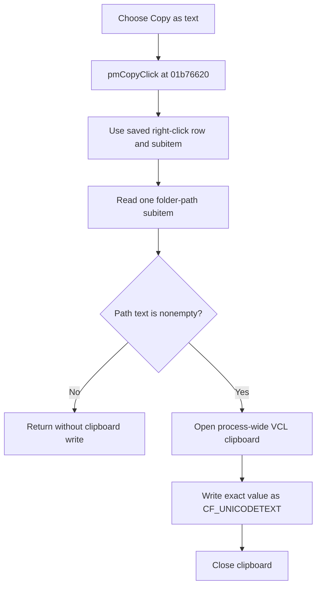

# Copy as text

> Analysis status: Evidence-backed source review complete.

## Control

| Property | Recovered value |
| --- | --- |
| Form | frmListEnvVars |
| Component path | frmListEnvVars.PopupMenu.pmCopy |
| Control class | TMenuItem |
| Caption | Copy as text |
| Hint | Not present in the recovered resource. |
| Text | Not present in the recovered resource. |
| Handler name | pmCopyClick |
| Handler address | 01b76620 |
| Graph node | `resource:dfm:frmListEnvVars/frmListEnvVars.PopupMenu.pmCopy` |
| Handler node | `function:01b76620` |
| Graph layer | UI |

## What happens when clicked

`TfrmListEnvVars.pmCopyClick` reads one list subitem from the row and column that the preceding right-click hit test saved. The form contains exactly four TINA folder rows: settings, private catalog, shared or common catalog, and temporary folder. It does not enumerate the Windows process environment.

If the path text is nonempty, the handler opens the process-wide VCL clipboard, writes the exact path as `CF_UNICODETEXT`, and closes the clipboard. The handler does not add the folder label, an equals sign, another row, or other formatting. It does not copy all four rows.

An empty string causes no clipboard operation. The handler always finalizes its temporary Unicode string before it returns.

## Input and selection behavior

- [`FUN_01b76540`](../../../DecompiledSources/Tina16/functions/0000000001B76540__FUN_01b76540.c) performs the right-click list-view hit test. It stores the row at form offset `+0x6e4` and the subitem number at `+0x6e8`, and then opens the popup menu.
- The copy handler obtains the saved row from the list view at form offset `+0x6b0` and reads subitem `saved column - 1`.
- The command uses the saved hit-test position. A current keyboard selection does not supply the value in the recovered path.
- [`FUN_01b75f80`](../../../DecompiledSources/Tina16/functions/0000000001B75F80__FUN_01b75f80.c) creates the four rows when the form opens. Each row has a localized folder label and one path subitem.

The [article for the command that opens this dialog](../editoropsdlg/btnlistenvvars-924c444ea0.md) describes the source of the four folder paths and the other list actions.

## Click flow

## Handler evidence

- Source: [DecompiledSources/Tina16/functions/0000000001B76620__FUN_01b76620.c](../../../DecompiledSources/Tina16/functions/0000000001B76620__FUN_01b76620.c)
- Recovered role: Copy the right-clicked TINA folder path to the Unicode clipboard.
- Current graph summary: Handles 1 Delphi UI event: frmListEnvVars.PopupMenu.pmCopy.OnClick.
- Current graph behavior: The checked-in graph does not yet contain the annotation prepared by this review.
- Current graph evidence: The handler reads a list-view subitem selected by saved hit-test indexes. It opens the VCL clipboard, writes clipboard format `0x0d` with a UTF-16 byte count, and closes the clipboard.
- Complexity: complex
- Distinct outgoing calls: 4

## Direct calls

- [`function:00414480`](../../../DecompiledSources/Tina16/functions/0000000000414480__FUN_00414480.c) — finalizes the temporary Delphi Unicode string.
- [`function:006a58e0`](../../../DecompiledSources/Tina16/functions/00000000006A58E0__FUN_006a58e0.c) — writes the string as clipboard format `0x0d` (`CF_UNICODETEXT`) with a byte count of `length * 2 + 2`.
- [`function:006a6030`](../../../DecompiledSources/Tina16/functions/00000000006A6030__FUN_006a6030.c) — returns the process-wide VCL clipboard wrapper. The handler uses its open and close virtual methods.
- [`function:006efcb0`](../../../DecompiledSources/Tina16/functions/00000000006EFCB0__FUN_006efcb0.c) — retrieves the saved list-view row by index.

## Resource evidence

- Kind: Not present in the recovered resource.
- Modal result: Not present in the recovered resource.
- Checked state: Not present in the recovered resource.
- List items: Not present in the recovered resource.
- Image reference: Not present in the recovered resource.
- Extracted glyph: None.

## Nearby label candidates

Nearby labels are layout candidates only. They are not proof of behavior.

- No same-parent label candidate is available.

## Analysis limits

- The handler has no independent test for a stale or invalid saved row or subitem. The normal path depends on the preceding right-click hit test. Behavior for invalid saved indexes is not established beyond the recovered list-item range-error path.
- The handler does not check a clipboard result and has no local clipboard-error branch, retry, message, or rollback.
- The click does not change a list row, a global folder path, a setting, the registry, or a file. It only changes the shared Windows clipboard when the selected text is nonempty.
- The path is plain text. It can contain an account name, a server name, or a share name. Another process can read it from the shared clipboard until the clipboard content changes.
- No hint, glyph, or nearby label supplies more behavior evidence for this menu item.
