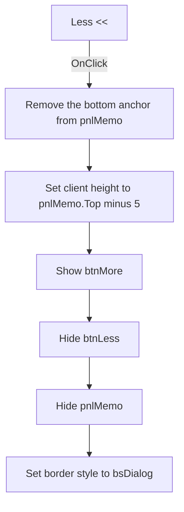

# Less <<

> Analysis status: Source reviewed. The collapsed detail state is documented.

## Control

| Property | Recovered value |
| --- | --- |
| Form | frmMatrixError |
| Component path | frmMatrixError.btnLess |
| Control class | TButton |
| Caption | Less << |
| Hint | Not present in the recovered resource. |
| Text | Not present in the recovered resource. |
| Handler name | btnLessClick |
| Handler address | 00c881a0 |
| Graph node | `resource:dfm:frmMatrixError/frmMatrixError.btnLess` |
| Handler node | `function:00c881a0` |
| Graph layer | UI |

## What happens when clicked

`btnLess` collapses the detail area of the Matrix Error dialog. The handler
uses the current `pnlMemo` geometry and applies these changes in order:

1. It removes the bottom anchor from `pnlMemo`. The recovered DFM gives the
   panel the left, top, and right anchors. The handler clears bit `8`, which is
   the bottom-anchor bit.
2. It sets the form's client height to `pnlMemo.Top - 5`. With the recovered
   design-time position, the calculated client height is 88 pixels.
3. It shows `btnMore`, hides `btnLess`, and hides `pnlMemo`.
4. It sets the form border style to value `3`, the Delphi `bsDialog` value.

The click does not change the error summary or the text in `memoError`. It does
not close the dialog. There is no validation or error branch. The shared
anchor, visibility, and border-style setters do not repeat their update when
the requested value is already active.

## Click flow

## Handler evidence

- Source: [DecompiledSources/Tina16/functions/0000000000C881A0__FUN_00c881a0.c](../../../DecompiledSources/Tina16/functions/0000000000C881A0__FUN_00c881a0.c)
- Recovered role: Matrix Error detail-collapse handler.
- Current graph summary: Handles 1 Delphi UI event: frmMatrixError.btnLess.OnClick.
- Behavior: Removes the detail panel's bottom anchor, reduces the client
  height, switches the More and Less button visibility, hides the detail
  panel, and restores a dialog border.
- Evidence: The source clears bit `8` in control field `+0xB3`, passes
  `pnlMemo.Top - 5` to the client-height setter, applies visibility values
  `1`, `0`, and `0` to the three form fields, and passes `3` to the recovered
  form border-style setter. The paired More handler applies the inverse state.
- Complexity: complex
- Distinct outgoing calls: 4

## Direct calls

- `function:0064c1a0` — changes `TControl.Anchors` when the value differs.
- `function:0064dbe0` — changes `TControl.Visible` when the value differs.
- `function:007fdf10` — sets the form client height.
- `function:007ff680` — changes the form border style when the value differs.

## Resource evidence

- Kind: Not present in the recovered resource.
- Modal result: Not present in the recovered resource.
- Checked state: Not present in the recovered resource.
- Initial visibility: Visible.
- Controlled detail area: `pnlMemo`, which contains `memoError`.
- Design-time `pnlMemo` geometry: `Top = 93`, `Height = 158`.
- List items: Not present in the recovered resource.
- Image reference: Not present in the recovered resource.
- Extracted glyph: None.

## Nearby label candidates

Nearby labels are layout candidates only. They are not proof of behavior.

- No same-parent label candidate is available.

## Analysis limits

- The design-time geometry gives a collapsed client height of 88 pixels. The
  handler uses the current runtime panel position, so display scaling can
  change the final value.
- The form field names are established by the paired handlers, DFM visibility
  and anchor properties, and the geometry read from the panel field.
- The knowledge-graph JSON export was absent during review. The same graph node,
  edge, layer, annotation, and resource checks used the canonical DuckDB graph.
