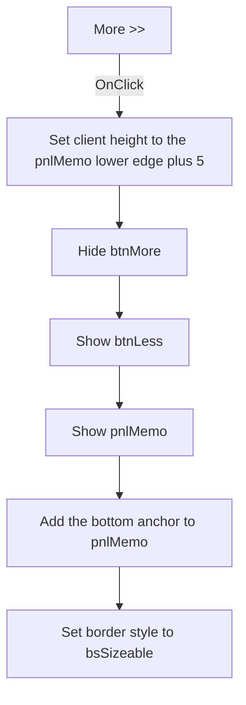

# More >>

> Analysis status: Source reviewed. The expanded detail state is documented.

## Control

| Property | Recovered value |
| --- | --- |
| Form | frmMatrixError |
| Component path | frmMatrixError.btnMore |
| Control class | TButton |
| Caption | More >> |
| Hint | Not present in the recovered resource. |
| Text | Not present in the recovered resource. |
| Handler name | btnMoreClick |
| Handler address | 00c88110 |
| Graph node | `resource:dfm:frmMatrixError/frmMatrixError.btnMore` |
| Handler node | `function:00c88110` |
| Graph layer | UI |

## What happens when clicked

`btnMore` expands the detail area of the Matrix Error dialog. The handler uses
the current `pnlMemo` geometry and applies these changes in order:

1. It sets the form's client height to `pnlMemo.Top + pnlMemo.Height + 5`.
   With the recovered design-time geometry, the calculated client height is
   256 pixels.
2. It hides `btnMore`, shows `btnLess`, and shows `pnlMemo`.
3. It adds the bottom anchor to `pnlMemo`. The handler sets bit `8` in the
   recovered anchor byte, while the DFM supplies the left, top, and right
   anchors.
4. It sets the form border style to value `2`, the Delphi `bsSizeable` value.

The click does not change the error summary or the text in `memoError`. It does
not close the dialog. There is no validation or error branch. The shared
anchor, visibility, and border-style setters do not repeat their update when
the requested value is already active.

## Click flow

## Handler evidence

- Source: [DecompiledSources/Tina16/functions/0000000000C88110__FUN_00c88110.c](../../../DecompiledSources/Tina16/functions/0000000000C88110__FUN_00c88110.c)
- Recovered role: Matrix Error detail-expansion handler.
- Current graph summary: Handles 1 Delphi UI event: frmMatrixError.btnMore.OnClick.
- Behavior: Increases the client height, switches the More and Less button
  visibility, shows the detail panel, adds its bottom anchor, and enables a
  sizable form border.
- Evidence: The source passes `pnlMemo.Top + pnlMemo.Height + 5` to the
  client-height setter, applies visibility values `0`, `1`, and `1` to the
  three form fields, sets bit `8` in control field `+0xB3`, and passes `2` to
  the recovered form border-style setter. The paired Less handler applies the
  inverse state.
- Complexity: complex
- Distinct outgoing calls: 4

## Direct calls

- `function:0064c1a0` — changes `TControl.Anchors` when the value differs.
- `function:0064dbe0` — changes `TControl.Visible` when the value differs.
- `function:007fdf10` — sets the form client height.
- `function:007ff680` — changes the form border style when the value differs.

## Resource evidence

- Kind: Not present in the recovered resource.
- Modal result: Not present in the recovered resource.
- Checked state: Not present in the recovered resource.
- Initial visibility: False.
- Controlled detail area: `pnlMemo`, which contains `memoError`.
- Design-time `pnlMemo` geometry: `Top = 93`, `Height = 158`.
- List items: Not present in the recovered resource.
- Image reference: Not present in the recovered resource.
- Extracted glyph: None.

## Nearby label candidates

Nearby labels are layout candidates only. They are not proof of behavior.

- No same-parent label candidate is available.

## Analysis limits

- The design-time geometry gives an expanded client height of 256 pixels. The
  handler uses the current runtime panel dimensions, so display scaling can
  change the final value.
- The form field names are established by the paired handlers, DFM visibility
  and anchor properties, and the geometry read from the panel field.
- The knowledge-graph JSON export was absent during review. The same graph node,
  edge, layer, annotation, and resource checks used the canonical DuckDB graph.
